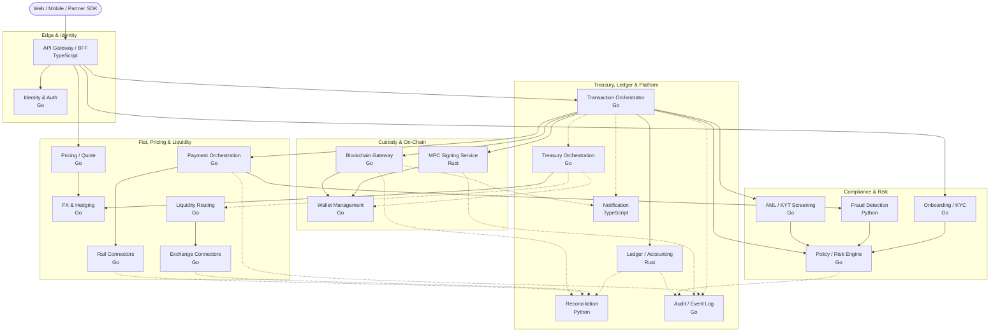

# Crypto On-Ramp — Service Architecture Diagram

End-to-end service topology. Solid arrows = synchronous request/response on the
transaction path. Dashed arrows = asynchronous events (event bus / webhooks).

## Reading the diagram

- **Transaction path (solid):** `Client → API Gateway → Transaction Orchestrator`,
  which drives the saga: Policy check → Payment capture → KYT screen → MPC sign →
  Blockchain broadcast → Ledger posting.
- **Compliance gate:** KYC (signup), Fraud, and KYT all feed the **Policy Engine**,
  the single gatekeeper before signing.
- **Async layer (dashed):** Treasury batches orders into aggregate buys via Liquidity
  Routing (handling the T+0 vs T+2/3 float); Reconciliation matches Ledger against
  bank, exchange, and on-chain state; Notification and Audit consume the event bus.
