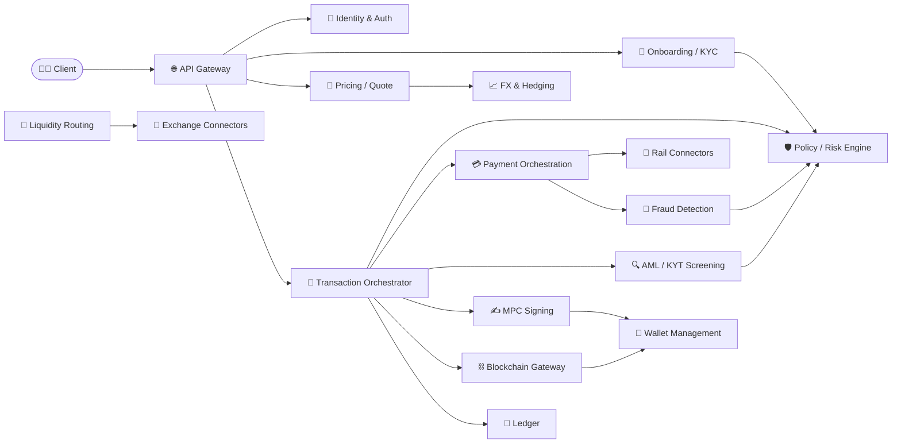
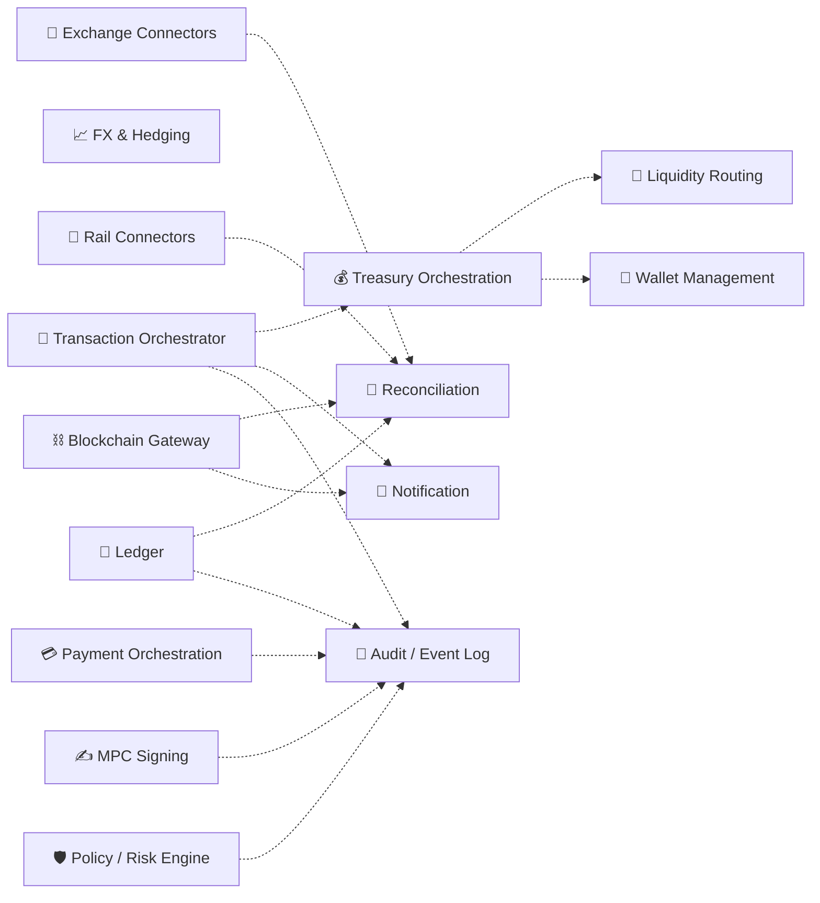

# Crypto On-Ramp — Microservices Architecture

[](https://github.com/ai-crypto-onramp/.github/actions/workflows/ci.yml)

Service breakdown to launch a crypto on-ramp end-to-end, mapped to the five-layer
architecture plus the treasury/ledger and platform plumbing.

## Table of Contents

- [Language philosophy](#language-philosophy)
- [Service Groups](#service-groups)
  - [Core Microservices](#core-microservices)
  - [Fiat, Pricing & Liquidity](#fiat-pricing--liquidity)
  - [Custody & On-Chain](#custody--on-chain)
  - [Treasury, Ledger & Platform](#treasury-ledger--platform)
- [Architecture](#architecture)
  - [Transaction path](#transaction-path)
  - [Async layer](#async-layer)
  - [Reading the diagrams](#reading-the-diagrams)
- [Dashboard](#dashboard)
  - [Running](#running)
  - [Gatus configuration](#gatus-configuration)

## Language philosophy

Minimize language sprawl. Standardize on:

- **Go** — transactional backbone (concurrency, latency, ops maturity)
- **Rust** — the two things where a bug means lost funds (signing + ledger)
- **TypeScript** — edge / BFF
- **Python** — where ML/data genuinely wins (fraud, risk)

## Service Groups

### Core Microservices

| Service | Language | Description |
|---|---|---|
| [**API Gateway / BFF**](https://github.com/ai-crypto-onramp/api-gateway) | TypeScript | Public edge. AuthN/Z, rate limiting, request shaping, aggregates backend calls for web/mobile SDKs. |
| [**Identity & Auth**](https://github.com/ai-crypto-onramp/identity-auth) | Go | User accounts, sessions, MFA, API keys for B2B partners, RBAC. |
| [**Onboarding / KYC**](https://github.com/ai-crypto-onramp/onboarding-kyc) | Go | Orchestrates identity verification via vendors (Onfido/Sumsub), document + liveness, sanctions/PEP screening at signup. |
| [**AML / KYT Screening**](https://github.com/ai-crypto-onramp/aml-kyt-screening) | Go | Pre-settlement Know-Your-Transaction checks against destination addresses (Chainalysis/TRM); blocks tainted flows before broadcast. |
| [**Policy / Risk Engine**](https://github.com/ai-crypto-onramp/policy-risk-engine) | Go | Per-tx caps, velocity limits, whitelisting, source auth. Auto-approves or routes to manual review. The gatekeeper before signing. |
| [**Fraud Detection**](https://github.com/ai-crypto-onramp/fraud-detection) | Python | ML scoring on payment + behavioral signals (chargeback/velocity models); feeds the policy engine. |

### Fiat, Pricing & Liquidity

| Service | Language | Description |
|---|---|---|
| [**Payment Orchestration**](https://github.com/ai-crypto-onramp/payment-orchestration) | Go | Fiat ingress. Normalizes across rails; manages 3DS, auth/capture, settlement webhooks, chargebacks. |
| [**Rail Connectors**](https://github.com/ai-crypto-onramp/rail-connectors) | Go | Adapter services per rail (card networks, ACH/SEPA/PIX/UPI). One deployable per rail family, common interface. |
| [**Pricing / Quote**](https://github.com/ai-crypto-onramp/pricing-quote) | Go | Real-time rate quotes with the ~30s rate-lock window; sources spreads and marks up fees. |
| [**FX & Hedging**](https://github.com/ai-crypto-onramp/fx-hedging) | Go | Manages currency exposure across daily flows, executes hedges, tracks slippage. |
| [**Liquidity Routing**](https://github.com/ai-crypto-onramp/liquidity-routing) | Go | Smart order routing + TWAP execution across exchanges/OTC desks; splits large orders. |
| [**Exchange Connectors**](https://github.com/ai-crypto-onramp/exchange-connectors) | Go | Venue-specific adapters (Binance, Kraken, OTC) — order placement, fills, balances. |

### Custody & On-Chain

| Service | Language | Description |
|---|---|---|
| [**MPC Signing Service**](https://github.com/ai-crypto-onramp/mpc-signing-service) | Rust | Threshold-signature (t-of-n) signing across distributed nodes. No single key. The most security-critical component. |
| [**Wallet Management**](https://github.com/ai-crypto-onramp/wallet-management) | Go | Hot/warm wallet inventory, address derivation/rotation, balance tracking per chain. |
| [**Blockchain Gateway**](https://github.com/ai-crypto-onramp/blockchain-gateway) | Go | Per-chain broadcast, gas prepayment/estimation, confirmation tracking, reorg handling, mempool monitoring. |

### Treasury, Ledger & Platform

| Service | Language | Description |
|---|---|---|
| [**Transaction Orchestrator**](https://github.com/ai-crypto-onramp/transaction-orchestrator) | Go | The saga engine tying payment → policy → sign → deliver into one atomic, recoverable flow with compensation. |
| [**Ledger / Accounting**](https://github.com/ai-crypto-onramp/ledger-accounting) | Rust | Immutable double-entry ledger — the single source of financial truth. Correctness over everything. |
| [**Treasury Orchestration**](https://github.com/ai-crypto-onramp/treasury-orchestration) | Go | Batches user orders into aggregate buys, manages the T+0 vs T+2/3 float, funding of hot wallets. |
| [**Reconciliation**](https://github.com/ai-crypto-onramp/reconciliation) | Python | Continuously matches internal ledger vs bank/exchange/on-chain state; flags breaks (a top-4 failure mode). |
| [**Notification**](https://github.com/ai-crypto-onramp/notification) | TypeScript | Email/SMS/push + partner webhooks for tx status. |
| [**Audit / Event Log**](https://github.com/ai-crypto-onramp/audit-event-log) | Go | Append-only audit trail for compliance and incident forensics; consumes the event bus. |

## Architecture

End-to-end service topology, split into two diagrams for readability:
**Transaction path** (synchronous request/response) and **Async layer**
(events, webhooks, reconciliation).

### Transaction path

Solid arrows = synchronous request/response on the transaction path.



### Async layer

Dashed arrows = asynchronous events (event bus / webhooks). Treasury batches orders
into aggregate buys; Reconciliation matches the Ledger against external state;
Notification and Audit consume the event bus.



### Reading the diagrams

- **Transaction path:** `Client → API Gateway → Transaction Orchestrator`,
  which drives the saga: Policy check → Payment capture → KYT screen → MPC sign →
  Blockchain broadcast → Ledger posting.
- **Compliance gate:** KYC (signup), Fraud, and KYT all feed the **Policy Engine**,
  the single gatekeeper before signing.
- **Async layer:** Treasury batches orders into aggregate buys via Liquidity
  Routing (handling the T+0 vs T+2/3 float); Reconciliation matches Ledger against
  bank, exchange, and on-chain state; Notification and Audit consume the event bus.

## Dashboard

All 21 services expose `GET /healthz` returning `{"status":"ok"}` on port `8080`
(inside the compose network). Gatus is the single status dashboard — configured
declaratively via `gatus.yml`, no manual UI setup required.

| Tool | Host port | URL |
|---|---|---|
| Gatus | 8090 | http://localhost:8090 |

### Running

```bash
docker compose -f .github/docker-compose.yml up -d --build
```

Then open http://localhost:8090. Gatus polls each `/healthz` endpoint every 30s
and renders the status page from `gatus.yml`. To add or change monitors, edit
`gatus.yml` and restart the `gatus` container.

### Gatus configuration

Monitors are defined in `gatus.yml`. Each endpoint block sets:

- `name`, `group` — shown on the dashboard
- `url` — the in-compose health URL (`http://<service>:8080/healthz`)
- `interval` — probe interval (default 30s)
- `conditions` — `[STATUS] == 200` and `[BODY].status == ok`
