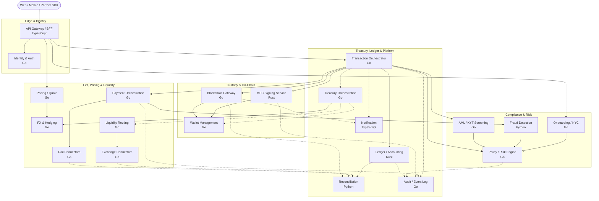

# Crypto On-Ramp — Microservices Architecture

Service breakdown to launch a crypto on-ramp end-to-end, mapped to the five-layer
architecture plus the treasury/ledger and platform plumbing.

## Language philosophy

Minimize language sprawl. Standardize on:

- **Go** — transactional backbone (concurrency, latency, ops maturity)
- **Rust** — the two things where a bug means lost funds (signing + ledger)
- **TypeScript** — edge / BFF
- **Python** — where ML/data genuinely wins (fraud, risk)

## Core Microservices

| Service | Status | Language | Description |
|---|---|---|---|
| [**API Gateway / BFF**](https://github.com/ai-crypto-onramp/api-gateway) | ⏳ | TypeScript | Public edge. AuthN/Z, rate limiting, request shaping, aggregates backend calls for web/mobile SDKs. |
| [**Identity & Auth**](https://github.com/ai-crypto-onramp/identity-auth) | ✅ | Go | User accounts, sessions, MFA, API keys for B2B partners, RBAC. |
| [**Onboarding / KYC**](https://github.com/ai-crypto-onramp/onboarding-kyc) | ✅ | Go | Orchestrates identity verification via vendors (Onfido/Sumsub), document + liveness, sanctions/PEP screening at signup. |
| [**AML / KYT Screening**](https://github.com/ai-crypto-onramp/aml-kyt-screening) | ✅ | Go | Pre-settlement Know-Your-Transaction checks against destination addresses (Chainalysis/TRM); blocks tainted flows before broadcast. |
| [**Policy / Risk Engine**](https://github.com/ai-crypto-onramp/policy-risk-engine) | ✅ | Go | Per-tx caps, velocity limits, whitelisting, source auth. Auto-approves or routes to manual review. The gatekeeper before signing. |
| [**Fraud Detection**](https://github.com/ai-crypto-onramp/fraud-detection) | ⏳ | Python | ML scoring on payment + behavioral signals (chargeback/velocity models); feeds the policy engine. |

## Fiat, Pricing & Liquidity

| Service | Status | Language | Description |
|---|---|---|---|
| [**Payment Orchestration**](https://github.com/ai-crypto-onramp/payment-orchestration) | ⏳ | Go | Fiat ingress. Normalizes across rails; manages 3DS, auth/capture, settlement webhooks, chargebacks. |
| [**Rail Connectors**](https://github.com/ai-crypto-onramp/rail-connectors) | ⏳ | Go | Adapter services per rail (card networks, ACH/SEPA/PIX/UPI). One deployable per rail family, common interface. |
| [**Pricing / Quote**](https://github.com/ai-crypto-onramp/pricing-quote) | ⏳ | Go | Real-time rate quotes with the ~30s rate-lock window; sources spreads and marks up fees. |
| [**FX & Hedging**](https://github.com/ai-crypto-onramp/fx-hedging) | ⏳ | Go | Manages currency exposure across daily flows, executes hedges, tracks slippage. |
| [**Liquidity Routing**](https://github.com/ai-crypto-onramp/liquidity-routing) | ⏳ | Go | Smart order routing + TWAP execution across exchanges/OTC desks; splits large orders. |
| [**Exchange Connectors**](https://github.com/ai-crypto-onramp/exchange-connectors) | ⏳ | Go | Venue-specific adapters (Binance, Kraken, OTC) — order placement, fills, balances. |

## Custody & On-Chain

| Service | Status | Language | Description |
|---|---|---|---|
| [**MPC Signing Service**](https://github.com/ai-crypto-onramp/mpc-signing-service) | ⏳ | Rust | Threshold-signature (t-of-n) signing across distributed nodes. No single key. The most security-critical component. |
| [**Wallet Management**](https://github.com/ai-crypto-onramp/wallet-management) | ⏳ | Go | Hot/warm wallet inventory, address derivation/rotation, balance tracking per chain. |
| [**Blockchain Gateway**](https://github.com/ai-crypto-onramp/blockchain-gateway) | ⏳ | Go | Per-chain broadcast, gas prepayment/estimation, confirmation tracking, reorg handling, mempool monitoring. |

## Treasury, Ledger & Platform

| Service | Status | Language | Description |
|---|---|---|---|
| [**Transaction Orchestrator**](https://github.com/ai-crypto-onramp/transaction-orchestrator) | ⏳ | Go | The saga engine tying payment → policy → sign → deliver into one atomic, recoverable flow with compensation. |
| [**Ledger / Accounting**](https://github.com/ai-crypto-onramp/ledger-accounting) | ⏳ | Rust | Immutable double-entry ledger — the single source of financial truth. Correctness over everything. |
| [**Treasury Orchestration**](https://github.com/ai-crypto-onramp/treasury-orchestration) | ⏳ | Go | Batches user orders into aggregate buys, manages the T+0 vs T+2/3 float, funding of hot wallets. |
| [**Reconciliation**](https://github.com/ai-crypto-onramp/reconciliation) | ⏳ | Python | Continuously matches internal ledger vs bank/exchange/on-chain state; flags breaks (a top-4 failure mode). |
| [**Notification**](https://github.com/ai-crypto-onramp/notification) | ⏳ | TypeScript | Email/SMS/push + partner webhooks for tx status. |
| [**Audit / Event Log**](https://github.com/ai-crypto-onramp/audit-event-log) | ⏳ | Go | Append-only audit trail for compliance and incident forensics; consumes the event bus. |

## Architecture

End-to-end service topology. Solid arrows = synchronous request/response on the
transaction path. Dashed arrows = asynchronous events (event bus / webhooks).

### Reading the diagram

- **Transaction path (solid):** `Client → API Gateway → Transaction Orchestrator`,
  which drives the saga: Policy check → Payment capture → KYT screen → MPC sign →
  Blockchain broadcast → Ledger posting.
- **Compliance gate:** KYC (signup), Fraud, and KYT all feed the **Policy Engine**,
  the single gatekeeper before signing.
- **Async layer (dashed):** Treasury batches orders into aggregate buys via Liquidity
  Routing (handling the T+0 vs T+2/3 float); Reconciliation matches Ledger against
  bank, exchange, and on-chain state; Notification and Audit consume the event bus.
