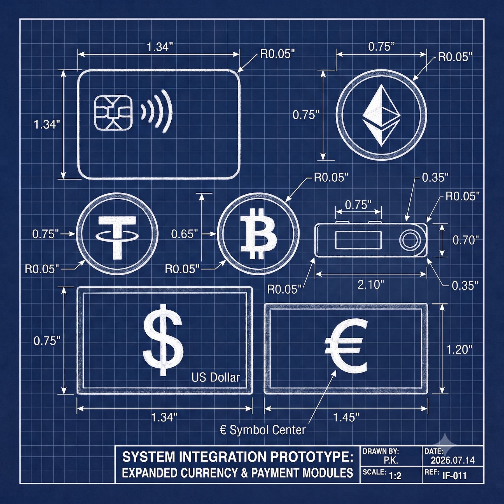
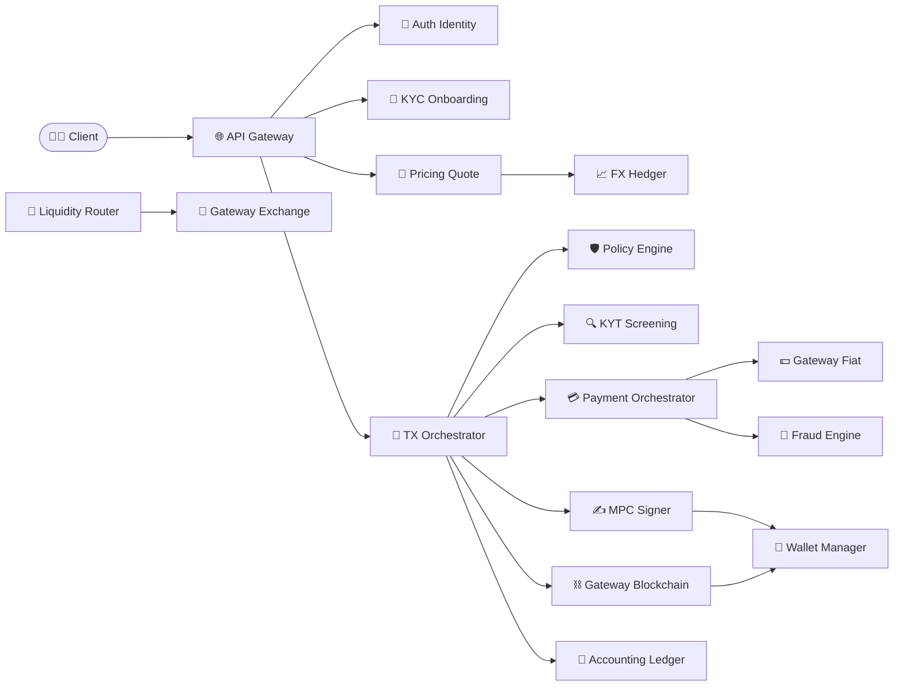
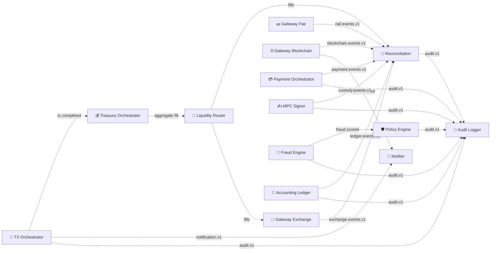

# Crypto On-Ramp — Microservices Architecture

[](https://github.com/ai-crypto-onramp/.github/actions/workflows/ci.yml)

Service breakdown of an experimental end-to-end crypto on-ramp, mapped to the five-layer architecture plus the treasury/ledger and platform plumbing. Inspired by [How Crypto On-Ramps Work: The Custody Architecture Behind the 'Buy Crypto' Button](https://fystack.io/blog/how-crypto-on-ramps-work)

<p align="center">
  
</p>

## Table of Contents

- [Language philosophy](#language-philosophy)
- [Service Groups](#service-groups)
  - [Core Microservices](#core-microservices)
  - [Fiat, Pricing & Liquidity](#fiat-pricing--liquidity)
  - [Custody & On-Chain](#custody--on-chain)
  - [Treasury, Ledger & Platform](#treasury-ledger--platform)
- [Architecture](#architecture)
  - [Transaction path](#transaction-path)
  - [Async layer](#async-layer)
  - [Reading the diagrams](#reading-the-diagrams)
- [Dashboard](#dashboard)
  - [Running](#running)
  - [Gatus configuration](#gatus-configuration)
- [Service Taxonomy](#service-taxonomy)
  - [Archetypes](#archetypes)

## Language philosophy

Minimized language sprawl. Standardized on:

- **Go** — transactional backbone (concurrency, latency, ops maturity)
- **Rust** — the two things where a bug means lost funds (signing + ledger)
- **TypeScript** — edge / BFF
- **Python** — where ML/data genuinely wins (fraud, risk)

## Service Groups

### Core Microservices

| Name | Lang | Description |
|---|---|---|
| [engine-fraud](https://github.com/ai-crypto-onramp/engine-fraud) | Python | ML scoring on payment + behavioral signals (chargeback/velocity models); feeds the policy engine. |
| [engine-policy-risk](https://github.com/ai-crypto-onramp/engine-policy-risk) | Go | Per-tx caps, velocity limits, whitelisting, source auth. Auto-approves or routes to manual review. The gatekeeper before signing. |
| [gateway-api](https://github.com/ai-crypto-onramp/gateway-api) | TS | Public edge. AuthN/Z, rate limiting, request shaping, aggregates backend calls for web/mobile SDKs. |
| [gateway-auth](https://github.com/ai-crypto-onramp/gateway-auth) | Go | User accounts, sessions, MFA, API keys for B2B partners, RBAC. |
| [kyc-onboarding](https://github.com/ai-crypto-onramp/kyc-onboarding) | Go | Orchestrates identity verification via vendors (Onfido/Sumsub), document + liveness, sanctions/PEP screening at signup. |
| [kyt-aml-screening](https://github.com/ai-crypto-onramp/kyt-aml-screening) | Go | Pre-settlement Know-Your-Transaction checks against destination addresses (Chainalysis/TRM); blocks tainted flows before broadcast. |

### Fiat, Pricing & Liquidity

| Name | Lang | Description |
|---|---|---|
| [engine-liquidity](https://github.com/ai-crypto-onramp/engine-liquidity) | Go | Smart order routing + TWAP execution across exchanges/OTC desks; splits large orders. |
| [engine-pricing](https://github.com/ai-crypto-onramp/engine-pricing) | Go | Real-time rate quotes with the ~30s rate-lock window; sources spreads and marks up fees. |
| [fx-hedger](https://github.com/ai-crypto-onramp/fx-hedger) | Go | Manages currency exposure across daily flows, executes hedges, tracks slippage. |
| [gateway-exchange](https://github.com/ai-crypto-onramp/gateway-exchange) | Go | Venue-specific adapters (Binance, Kraken, OTC) — order placement, fills, balances. |
| [gateway-fiat](https://github.com/ai-crypto-onramp/gateway-fiat) | Go | Adapter services per rail (card networks, ACH/SEPA/PIX/UPI). One deployable per rail family, common interface. |
| [orchestrator-fiat](https://github.com/ai-crypto-onramp/orchestrator-fiat) | Go | Fiat ingress. Normalizes across rails; manages 3DS, auth/capture, settlement webhooks, chargebacks. |

### Custody & On-Chain

| Name | Lang | Description |
|---|---|---|
| [gateway-blockchain](https://github.com/ai-crypto-onramp/gateway-blockchain) | Go | Per-chain broadcast, gas prepayment/estimation, confirmation tracking, reorg handling, mempool monitoring. |
| [mpc-signer](https://github.com/ai-crypto-onramp/mpc-signer) | Rust | Threshold-signature (t-of-n) signing across distributed nodes. No single key. The most security-critical component. |
| [wallet-manager](https://github.com/ai-crypto-onramp/wallet-manager) | Go | Hot/warm wallet inventory, address derivation/rotation, balance tracking per chain. |

### Treasury, Ledger & Platform

| Name | Lang | Description |
|---|---|---|
| [accounting-ledger](https://github.com/ai-crypto-onramp/accounting-ledger) | Rust | Immutable double-entry ledger — the single source of financial truth. Correctness over everything. |
| [audit-logger](https://github.com/ai-crypto-onramp/audit-logger) | Go | Append-only audit trail for compliance and incident forensics; consumes the event bus. |
| [engine-recon](https://github.com/ai-crypto-onramp/engine-recon) | Python | Continuously matches internal ledger vs bank/exchange/on-chain state; flags breaks (a top-4 failure mode). |
| [notifier](https://github.com/ai-crypto-onramp/notifier) | TS | Email/SMS/push + partner webhooks for tx status. |
| [orchestrator-treasury](https://github.com/ai-crypto-onramp/orchestrator-treasury) | Go | Batches user orders into aggregate buys, manages the T+0 vs T+2/3 float, funding of hot wallets. |
| [orchestrator-tx](https://github.com/ai-crypto-onramp/orchestrator-tx) | Go | The saga engine tying payment → policy → sign → deliver into one atomic, recoverable flow with compensation. |

### UI Systems

| UI | Language | Description |
|---|---|---|
| [ui-back-office](https://github.com/ai-crypto-onramp/ui-back-office) | Python | Treasury & finance console (Streamlit). Treasury dashboard, liquidity routing, FX hedging, ledger viewer, reconciliation, wallet inventory. |
| [ui-front-office](https://github.com/ai-crypto-onramp/ui-front-office) | TS | Customer-facing web app (Next.js). Signup, KYC, quoting, checkout, transaction dashboard, wallet management. |
| [ui-middle-office](https://github.com/ai-crypto-onramp/ui-middle-office) | TS | Internal compliance & ops console (React SPA). KYC review, AML/KYT alert desk, policy/risk dashboard, user management, audit explorer. |

## Architecture

End-to-end service topology, split into two diagrams for readability:

- **Transaction path** (synchronous request/response)
- **Async layer** (events, webhooks, reconciliation).

### Transaction path

Solid arrows = synchronous request/response on the transaction path.


```mermaid
flowchart LR
    Client([🧑‍💻 Client])
    GW[🌐 API Gateway]
    AUTH[🔐 Auth Identity]
    KYC[🪪 KYC Onboarding]
    PRICE[💱 Pricing Quote]
    ORCH[🔀 TX Orchestrator]
    POLICY[🛡️ Policy Engine]
    KYT[🔍 KYT Screening]
    PAY[💳 Payment Orchestrator]
    RAILS[💵 Gateway Fiat]
    FRAUD[🚨 Fraud Engine]
    FX[📈 FX Hedger]
    MPC[✍️ MPC Signer]
    WALLET[👛 Wallet Manager]
    CHAIN[⛓️ Gateway Blockchain]
    LEDGER[📖 Accounting Ledger]
    LIQ[🔄 Liquidity Router]
    EXCH[🏬 Gateway Exchange]

    Client --> GW
    GW --> AUTH
    GW --> KYC
    GW --> PRICE
    GW --> ORCH
    ORCH --> POLICY
    ORCH --> KYT
    ORCH --> PAY
    ORCH --> MPC
    ORCH --> CHAIN
    ORCH --> LEDGER
    PAY --> RAILS
    PAY --> FRAUD
    PRICE --> FX
    LIQ --> EXCH
    MPC --> WALLET
    CHAIN --> WALLET
```

### Async layer

Dashed arrows = asynchronous events (Kafka topics). The event bus carries
three categories: (1) domain events from money-moving services consumed by
Reconciliation for matching, (2) `tx.completed` events from the Orchestrator
consumed by Treasury for batch aggregation, (3) audit and notification events
consumed by the Audit Log and Notifier. Topic names are shown in brackets.


```mermaid
flowchart LR
    ORCH[🔀 TX Orchestrator]
    TREAS[💰 Treasury Orchestrator]
    LIQ[🔄 Liquidity Router]
    EXCH[🏬 Gateway Exchange]
    RAILS[💵 Gateway Fiat]
    CHAIN[⛓️ Gateway Blockchain]
    PAY[💳 Payment Orchestrator]
    MPC[✍️ MPC Signer]
    FRAUD[🚨 Fraud Engine]
    POLICY[🛡️ Policy Engine]
    LEDGER[📖 Accounting Ledger]
    RECON[🧮 Reconciliation]
    NOTIF[🔔 Notifier]
    AUDIT[📜 Audit Logger]

    ORCH -.->|tx.completed| TREAS
    TREAS -.->|aggregate fill| LIQ
    LIQ -.->|fills| RECON
    LIQ -.->|fills| EXCH
    EXCH -.->|exchange.events.v1| RECON
    RAILS -.->|rail.events.v1| RECON
    CHAIN -.->|blockchain.events.v1| RECON
    CHAIN -.->|tx.confirmed| NOTIF
    PAY -.->|payment.events.v1| RECON
    MPC -.->|custody.events.v1| RECON
    FRAUD -.->|fraud.scored| POLICY
    LEDGER -.->|ledger.events.v1| RECON
    ORCH -.->|notification.v1| NOTIF
    ORCH -.->|audit.v1| AUDIT
    PAY -.->|audit.v1| AUDIT
    MPC -.->|audit.v1| AUDIT
    POLICY -.->|audit.v1| AUDIT
    LEDGER -.->|audit.v1| AUDIT
    FRAUD -.->|audit.v1| AUDIT
    RECON -.->|audit.v1| AUDIT
```

### Reading the diagrams

- **Transaction path:** `Client → API Gateway → Transaction Orchestrator`,
  which drives the saga: Policy check → Payment capture → KYT screen → MPC sign →
  Blockchain broadcast → Ledger posting.
- **Compliance gate:** KYC (at signup) and KYT (per-transaction, called by the
  Orchestrator) feed the **Policy Engine** — the single gatekeeper before
  signing. Fraud scores are delivered async via the `fraud.scored` Kafka topic
  (see async diagram); the Payment Orchestrator also calls Fraud synchronously
  for a real-time score on each transaction.
- **Async layer — domain events → Reconciliation:** Every money-moving service
  (Ledger, Fiat, Exchange, Blockchain, Liquidity, Payment, Custody) publishes
  domain events to its dedicated Kafka topic. Reconciliation consumes all of
  them and matches the internal ledger against bank, exchange, and on-chain
  state.
- **Async layer — tx.completed → Treasury:** The Orchestrator publishes
  `tx.completed` to the `transactions` topic; Treasury consumes it to add the
  tx to an aggregate buy batch, then routes the fill via Liquidity Routing.
- **Async layer — audit & notification:** All services publish audit events to
  `audit.v1` (consumed by Audit Logger). The Orchestrator and Blockchain
  Gateway publish lifecycle events to `notification.v1` (consumed by Notifier).

### Async event topics

All Kafka topics in the stack, sorted alphabetically:

| Topic | Description | Producers | Consumers |
|---|---|---|---|
| `audit.v1` | Append-only audit trail for compliance and incident forensics. Canonical envelope: `schema_version`, `id`, `ts`, `source_service`, `actor_id`, `action`, `target_type`, `target_id`, `payload_hash`, `payload`. | engine-fraud, gateway-blockchain, kyt-aml-screening, mpc-signer, notifier, orchestrator-fiat, engine-policy-risk, engine-recon, orchestrator-tx | audit-logger |
| `blockchain.events.v1` | On-chain transaction lifecycle events (broadcast, confirmation, reorg, mempool). | gateway-blockchain | notifier, engine-recon |
| `custody.events.v1` | Custody operations (key creation, signing, key rotation) from the MPC threshold-signing service. | mpc-signer | engine-recon |
| `exchange.events.v1` | Order placement, fills, and balance updates from exchange venue adapters. | gateway-exchange | engine-recon |
| `fraud.scored` | Fraud risk score and risk band per transaction, emitted after scoring on payment + behavioral signals. | engine-fraud | engine-policy-risk |
| `ledger.events.v1` | Immutable double-entry ledger postings and balance changes. | accounting-ledger | engine-recon |
| `liquidity.fills` | Fill events from smart order routing (TWAP/VWAP slicing across venues). | engine-liquidity | engine-recon |
| `notification.v1` | Transaction lifecycle notifications (tx.created, tx.confirmed, tx.failed) for email/SMS/push/webhook delivery. | gateway-blockchain, orchestrator-tx | notifier |
| `payment.events.v1` | Payment lifecycle events (intent created, authorized, captured, refunded, chargeback). | orchestrator-fiat | engine-recon |
| `rail.events.v1` | Rail settlement events (card, ACH, SEPA, PIX, UPI) — confirmation, rejection, settlement status. | gateway-fiat | engine-recon |
| `transactions` | Saga state transitions (transaction.created, step.start, step.success, tx.completed, tx.failed). The outbox relay polls every 100ms and publishes to this topic. | orchestrator-tx | orchestrator-treasury |

## Dashboard

All 21 services expose `GET /healthz` returning `{"status":"ok"}` on port `8080`
(inside the compose network). Gatus is the single status dashboard — configured
declaratively via `gatus.yml`, no manual UI setup required.

| Tool | Host port | URL |
|---|---|---|
| Gatus | 8090 | http://localhost:8090 |
| Front Office UI | 8102 | http://localhost:8102 |
| Middle Office UI | 8103 | http://localhost:8103 |
| Back Office UI | 8104 | http://localhost:8104 |

### Running

```bash
docker compose -f .github/docker-compose.yml up -d --build
```

Then open http://localhost:8090. Gatus polls each `/healthz` endpoint every 30s
and renders the status page from `gatus.yml`. To add or change monitors, edit
`gatus.yml` and restart the `gatus` container.

### Gatus configuration

Monitors are defined in `gatus.yml`. Each endpoint block sets:

- `name`, `group` — shown on the dashboard
- `url` — the in-compose health URL (`http://<service>:8080/healthz`)
- `interval` — probe interval (default 30s)
- `conditions` — `[STATUS] == 200` and `[BODY].status == ok`

## Service Taxonomy

The services follow a role-based naming convention. Each suffix denotes the
**role** the service plays in the system, not its domain. Domain is conveyed by
the prefix. Picking the right suffix means identifying the service's **dominant**
trait, since most real services are hybrids of several roles.

### Archetypes

#### `gateway-*` — boundary service

Services that sit on a **boundary** between two zones and translate between them.
Two flavors:

- **External-system boundary** — I/O translators between the platform and an
  outside system. They speak some external protocol (REST / FIX / RPC / chain
  RPC) and emit or consume a canonical internal representation. They do **not**
  make business decisions.
  - `gateway-api` — public REST / BFF entry point
  - `gateway-blockchain` — chain RPC adapter
  - `gateway-exchange` — exchange / OTC venue adapter
  - `gateway-fiat` — bank / rail adapter
- **Trust boundary** — the control plane that separates untrusted callers from
  the trusted internal estate. They authenticate, authorize, and credential
  callers before any internal service will accept their requests.
  - `gateway-auth` — user accounts, sessions, MFA, API keys, RBAC; the boundary
    every inbound caller crosses before reaching `gateway-api` and downstream
    services.

**Rule:** if the service's job is "translate between us and the outside world"
**or** "gate who is allowed into the inside", it is a gateway. The `gateway-`
prefix means *boundary*; the boundary may be a protocol boundary or a trust
boundary.

#### `engine-*` — domain computation / decision

Stateless or stateful services that take inputs and produce a **decision,
transform, or computation**. The business algorithm lives here.

- `engine-fraud` — fraud scoring
- `engine-policy-risk` — policy / risk evaluation
- `engine-pricing` — quote computation
- `engine-liquidity` — smart order routing + TWAP / VWAP execution
- `engine-recon` — reconciliation matching and break detection

**Rule:** if the service's value is "the algorithm", it is an engine.

#### `orchestrator-*` — workflow coordination

Saga / state-machine coordinators that **sequence calls** across multiple
services, own transactional flow, and handle compensation. They do not compute
the domain answer themselves — they direct who does.

- `orchestrator-tx` — transaction (buy) lifecycle
- `orchestrator-fiat` — fiat payment / capture lifecycle
- `orchestrator-treasury` — aggregate funding / hedging workflow

**Rule:** if the service's value is "the workflow", it is an orchestrator.

#### Domain-specific nouns — unique archetypes

Services whose role is singular enough that a generic suffix would obscure
rather than clarify. Kept as domain nouns.

- `accounting-ledger` — append-only ledger is its own archetype.
- `audit-logger` — event sink.
- `notifier` — fan-out sink.
- `wallet-manager` — custody inventory: hot / warm / cold wallets, address
  derivation, UTXO and nonce management, MPC key mapping. The `wallet-manager`
  name is established industry vocabulary; treated as a domain noun rather than
  an instance of a generic `-manager` archetype.
- `fx-hedger` — domain noun (FX hedging desk role).
- `kyc-onboarding`, `kyt-aml-screening` — process nouns.

#### `ui-*` — presentation layer

Separate axis entirely; not subject to the backend taxonomy.

- `ui-front-office`, `ui-middle-office`, `ui-back-office`

### Choosing a suffix

1. Is it a protocol boundary to an external system, or a trust boundary that
   gates callers into the inside? -> `gateway-*`
2. Is its value the algorithm / decision? -> `engine-*`
3. Is its value coordinating a multi-service workflow? -> `orchestrator-*`
4. Is its role singular enough that a generic suffix would obscure it? ->
   domain noun
5. Is it presentation? -> `ui-*`

Most real services are hybrids. Pick the **dominant** trait; the taxonomy is a
useful discriminator, not a pure classification.

