# Database ER Diagrams — Service Migrations

This report documents the database schema of every service in the monorepo, derived from each service's SQL / Alembic migration files. For each service an **ER diagram** (Mermaid `erDiagram`) is generated, followed by a **combined diagram** showing the logical cross-service relationships.

> Notes on duplicates: several services ship the same migration under two paths (e.g. `migrations/` and `internal/store/migrations/`). Only the most complete copy was analyzed:
> - `orchestrator-treasury` — `migrations/` == `internal/store/migrations/`
> - `wallet-manager` — `migrations/` == `internal/migrations/`
> - `audit-logger` — `migrations/001_init.sql` == `internal/store/migrations/0001_init_up.sql`
> - `gateway-blockchain` — `migrations/` == `internal/store/migrations/` == `internal/store/postgres/migrations/`
>
> "Logical" foreign keys (columns that conceptually reference another table but lack an actual `REFERENCES` constraint) are rendered as dotted relationships in the combined diagram and listed in each service's "Cross-service logical references" section.

---

## Table of Contents

1. [accounting-ledger](#accounting-ledger)
2. [audit-logger](#audit-logger)
3. [engine-fraud](#engine-fraud)
4. [engine-liquidity](#engine-liquidity)
5. [engine-policy-risk](#engine-policy-risk)
6. [engine-pricing](#engine-pricing)
7. [engine-recon](#engine-recon)
8. [fx-hedger](#fx-hedger)
9. [gateway-auth](#gateway-auth)
10. [gateway-blockchain](#gateway-blockchain)
11. [gateway-exchange](#gateway-exchange)
12. [gateway-fiat](#gateway-fiat)
13. [kyc-onboarding](#kyc-onboarding)
14. [kyt-aml-screening](#kyt-aml-screening)
15. [notifier](#notifier)
16. [orchestrator-fiat](#orchestrator-fiat)
17. [orchestrator-treasury](#orchestrator-treasury)
18. [orchestrator-tx](#orchestrator-tx)
19. [wallet-manager](#wallet-manager)
20. [Combined cross-service diagram](#combined-cross-service-diagram)

---

## accounting-ledger

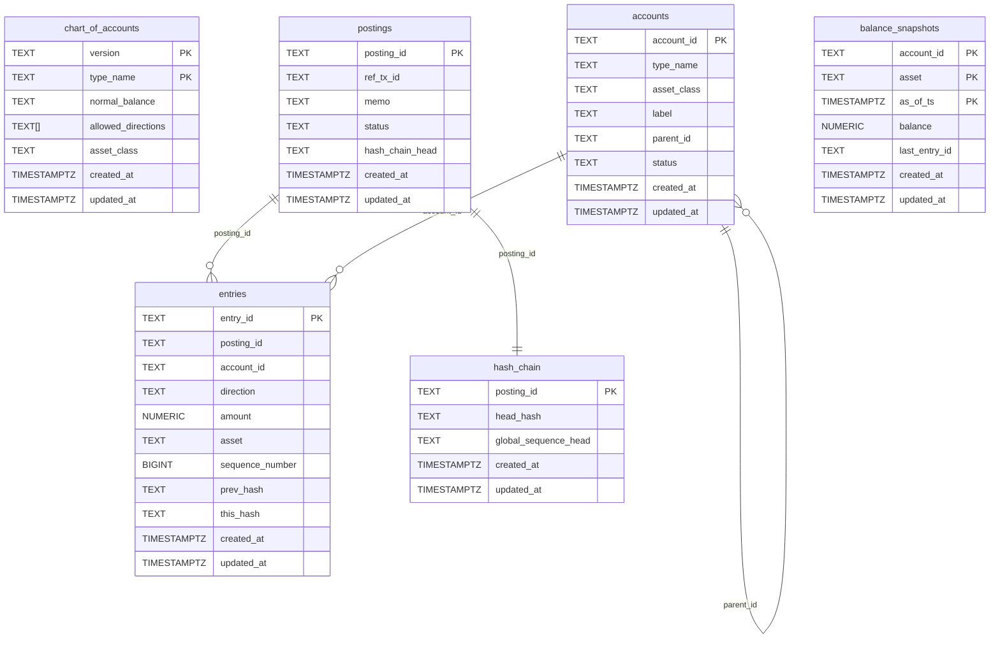
```mermaid
erDiagram
  chart_of_accounts {
    TEXT version PK
    TEXT type_name PK
    TEXT normal_balance
    TEXT[] allowed_directions
    TEXT asset_class
    TIMESTAMPTZ created_at
    TIMESTAMPTZ updated_at
  }
  accounts {
    TEXT account_id PK
    TEXT type_name
    TEXT asset_class
    TEXT label
    TEXT parent_id
    TEXT status
    TIMESTAMPTZ created_at
    TIMESTAMPTZ updated_at
  }
  postings {
    TEXT posting_id PK
    TEXT ref_tx_id
    TEXT memo
    TEXT status
    TEXT hash_chain_head
    TIMESTAMPTZ created_at
    TIMESTAMPTZ updated_at
  }
  entries {
    TEXT entry_id PK
    TEXT posting_id
    TEXT account_id
    TEXT direction
    NUMERIC amount
    TEXT asset
    BIGINT sequence_number
    TEXT prev_hash
    TEXT this_hash
    TIMESTAMPTZ created_at
    TIMESTAMPTZ updated_at
  }
  balance_snapshots {
    TEXT account_id PK
    TEXT asset PK
    TIMESTAMPTZ as_of_ts PK
    NUMERIC balance
    TEXT last_entry_id
    TIMESTAMPTZ created_at
    TIMESTAMPTZ updated_at
  }
  hash_chain {
    TEXT posting_id PK
    TEXT head_hash
    TEXT global_sequence_head
    TIMESTAMPTZ created_at
    TIMESTAMPTZ updated_at
  }

  accounts ||--o{ accounts : "parent_id"
  postings ||--o{ entries : "posting_id"
  accounts ||--o{ entries : "account_id"
  postings ||--|| hash_chain : "posting_id"
```

**Cross-service logical references**
- `postings.ref_tx_id -> orchestrator-tx.transactions.tx_id`
- `entries.account_id` — references `accounts.account_id` (internal); per-user accounts encode `user_id` by convention → `gateway-auth.users.id`

---

## audit-logger

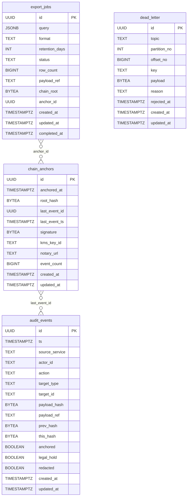
```mermaid
erDiagram
  audit_events {
    UUID id PK
    TIMESTAMPTZ ts
    TEXT source_service
    TEXT actor_id
    TEXT action
    TEXT target_type
    TEXT target_id
    BYTEA payload_hash
    TEXT payload_ref
    BYTEA prev_hash
    BYTEA this_hash
    BOOLEAN anchored
    BOOLEAN legal_hold
    BOOLEAN redacted
    TIMESTAMPTZ created_at
    TIMESTAMPTZ updated_at
  }
  chain_anchors {
    UUID id PK
    TIMESTAMPTZ anchored_at
    BYTEA root_hash
    UUID last_event_id
    TIMESTAMPTZ last_event_ts
    BYTEA signature
    TEXT kms_key_id
    TEXT notary_url
    BIGINT event_count
    TIMESTAMPTZ created_at
    TIMESTAMPTZ updated_at
  }
  export_jobs {
    UUID id PK
    JSONB query
    TEXT format
    INT retention_days
    TEXT status
    BIGINT row_count
    TEXT payload_ref
    BYTEA chain_root
    UUID anchor_id
    TIMESTAMPTZ created_at
    TIMESTAMPTZ updated_at
    TIMESTAMPTZ completed_at
  }
  dead_letter {
    UUID id PK
    TEXT topic
    INT partition_no
    BIGINT offset_no
    TEXT key
    BYTEA payload
    TEXT reason
    TIMESTAMPTZ rejected_at
    TIMESTAMPTZ created_at
    TIMESTAMPTZ updated_at
  }

  chain_anchors }o..o{ audit_events : "last_event_id"
  export_jobs }o..o{ chain_anchors : "anchor_id"
```

**Cross-service logical references**
- `audit_events.actor_id -> gateway-auth.users.id`
- `audit_events.target_id` — polymorphic; varies by `target_type` (any service entity)
- Receives audit events via outbox from: `gateway-auth`, `kyc-onboarding`, `kyt-aml-screening`, `wallet-manager`, `orchestrator-treasury`, `engine-liquidity`

---

## engine-fraud

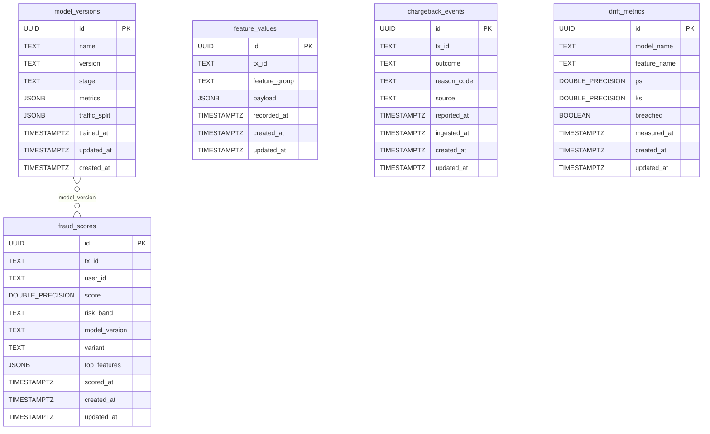
```mermaid
erDiagram
  fraud_scores {
    UUID id PK
    TEXT tx_id
    TEXT user_id
    DOUBLE_PRECISION score
    TEXT risk_band
    TEXT model_version
    TEXT variant
    JSONB top_features
    TIMESTAMPTZ scored_at
    TIMESTAMPTZ created_at
    TIMESTAMPTZ updated_at
  }
  model_versions {
    UUID id PK
    TEXT name
    TEXT version
    TEXT stage
    JSONB metrics
    JSONB traffic_split
    TIMESTAMPTZ trained_at
    TIMESTAMPTZ updated_at
    TIMESTAMPTZ created_at
  }
  feature_values {
    UUID id PK
    TEXT tx_id
    TEXT feature_group
    JSONB payload
    TIMESTAMPTZ recorded_at
    TIMESTAMPTZ created_at
    TIMESTAMPTZ updated_at
  }
  chargeback_events {
    UUID id PK
    TEXT tx_id
    TEXT outcome
    TEXT reason_code
    TEXT source
    TIMESTAMPTZ reported_at
    TIMESTAMPTZ ingested_at
    TIMESTAMPTZ created_at
    TIMESTAMPTZ updated_at
  }
  drift_metrics {
    UUID id PK
    TEXT model_name
    TEXT feature_name
    DOUBLE_PRECISION psi
    DOUBLE_PRECISION ks
    BOOLEAN breached
    TIMESTAMPTZ measured_at
    TIMESTAMPTZ created_at
    TIMESTAMPTZ updated_at
  }

  model_versions }o..o{ fraud_scores : "model_version"
```

**Cross-service logical references**
- `fraud_scores.tx_id -> orchestrator-tx.transactions.tx_id`
- `fraud_scores.user_id -> gateway-auth.users.id`
- `feature_values.tx_id -> orchestrator-tx.transactions.tx_id`
- `chargeback_events.tx_id -> orchestrator-tx.transactions.tx_id` (or `orchestrator-fiat.chargebacks.id`)

---

## engine-liquidity

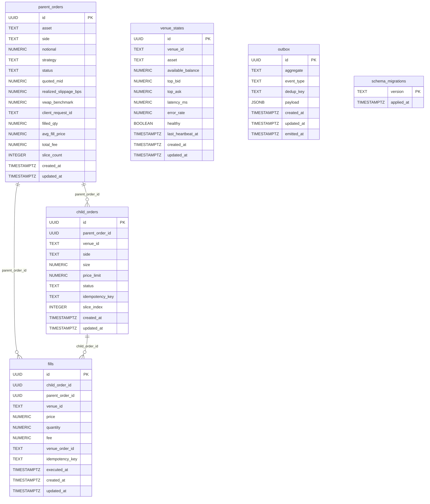
```mermaid
erDiagram
  parent_orders {
    UUID id PK
    TEXT asset
    TEXT side
    NUMERIC notional
    TEXT strategy
    TEXT status
    NUMERIC quoted_mid
    NUMERIC realized_slippage_bps
    NUMERIC vwap_benchmark
    TEXT client_request_id
    NUMERIC filled_qty
    NUMERIC avg_fill_price
    NUMERIC total_fee
    INTEGER slice_count
    TIMESTAMPTZ created_at
    TIMESTAMPTZ updated_at
  }
  child_orders {
    UUID id PK
    UUID parent_order_id
    TEXT venue_id
    TEXT side
    NUMERIC size
    NUMERIC price_limit
    TEXT status
    TEXT idempotency_key
    INTEGER slice_index
    TIMESTAMPTZ created_at
    TIMESTAMPTZ updated_at
  }
  fills {
    UUID id PK
    UUID child_order_id
    UUID parent_order_id
    TEXT venue_id
    NUMERIC price
    NUMERIC quantity
    NUMERIC fee
    TEXT venue_order_id
    TEXT idempotency_key
    TIMESTAMPTZ executed_at
    TIMESTAMPTZ created_at
    TIMESTAMPTZ updated_at
  }
  venue_states {
    UUID id PK
    TEXT venue_id
    TEXT asset
    NUMERIC available_balance
    NUMERIC top_bid
    NUMERIC top_ask
    NUMERIC latency_ms
    NUMERIC error_rate
    BOOLEAN healthy
    TIMESTAMPTZ last_heartbeat_at
    TIMESTAMPTZ created_at
    TIMESTAMPTZ updated_at
  }
  outbox {
    UUID id PK
    TEXT aggregate
    TEXT event_type
    TEXT dedup_key
    JSONB payload
    TIMESTAMPTZ created_at
    TIMESTAMPTZ updated_at
    TIMESTAMPTZ emitted_at
  }
  schema_migrations {
    TEXT version PK
    TIMESTAMPTZ applied_at
  }

  parent_orders ||--o{ child_orders : "parent_order_id"
  parent_orders ||--o{ fills : "parent_order_id"
  child_orders ||--o{ fills : "child_order_id"
```

**Cross-service logical references**
- `child_orders.venue_id -> engine-pricing.rate_sources.name`
- `fills.venue_order_id -> gateway-exchange.orders.venue_order_id`
- `parent_orders.id` — referenced by `orchestrator-treasury.aggregate_orders.id` (likely)
- `outbox -> audit-logger.audit_events`

---

## engine-policy-risk

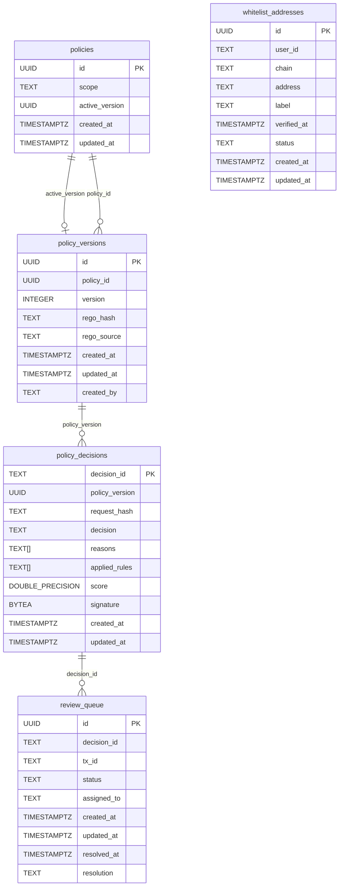
```mermaid
erDiagram
  policies {
    UUID id PK
    TEXT scope
    UUID active_version
    TIMESTAMPTZ created_at
    TIMESTAMPTZ updated_at
  }
  policy_versions {
    UUID id PK
    UUID policy_id
    INTEGER version
    TEXT rego_hash
    TEXT rego_source
    TIMESTAMPTZ created_at
    TIMESTAMPTZ updated_at
    TEXT created_by
  }
  policy_decisions {
    TEXT decision_id PK
    UUID policy_version
    TEXT request_hash
    TEXT decision
    TEXT[] reasons
    TEXT[] applied_rules
    DOUBLE_PRECISION score
    BYTEA signature
    TIMESTAMPTZ created_at
    TIMESTAMPTZ updated_at
  }
  whitelist_addresses {
    UUID id PK
    TEXT user_id
    TEXT chain
    TEXT address
    TEXT label
    TIMESTAMPTZ verified_at
    TEXT status
    TIMESTAMPTZ created_at
    TIMESTAMPTZ updated_at
  }
  review_queue {
    UUID id PK
    TEXT decision_id
    TEXT tx_id
    TEXT status
    TEXT assigned_to
    TIMESTAMPTZ created_at
    TIMESTAMPTZ updated_at
    TIMESTAMPTZ resolved_at
    TEXT resolution
  }

  policies ||--o| policy_versions : "active_version"
  policies ||--o{ policy_versions : "policy_id"
  policy_versions ||--o{ policy_decisions : "policy_version"
  policy_decisions ||--o{ review_queue : "decision_id"
```

**Cross-service logical references**
- `whitelist_addresses.user_id -> gateway-auth.users.id`
- `whitelist_addresses.address -> wallet-manager.addresses.address`
- `review_queue.tx_id -> orchestrator-tx.transactions.tx_id`
- `policy_decisions.decision_id` — referenced by `wallet-manager.withdrawal_requests.policy_decision_id`

---

## engine-pricing

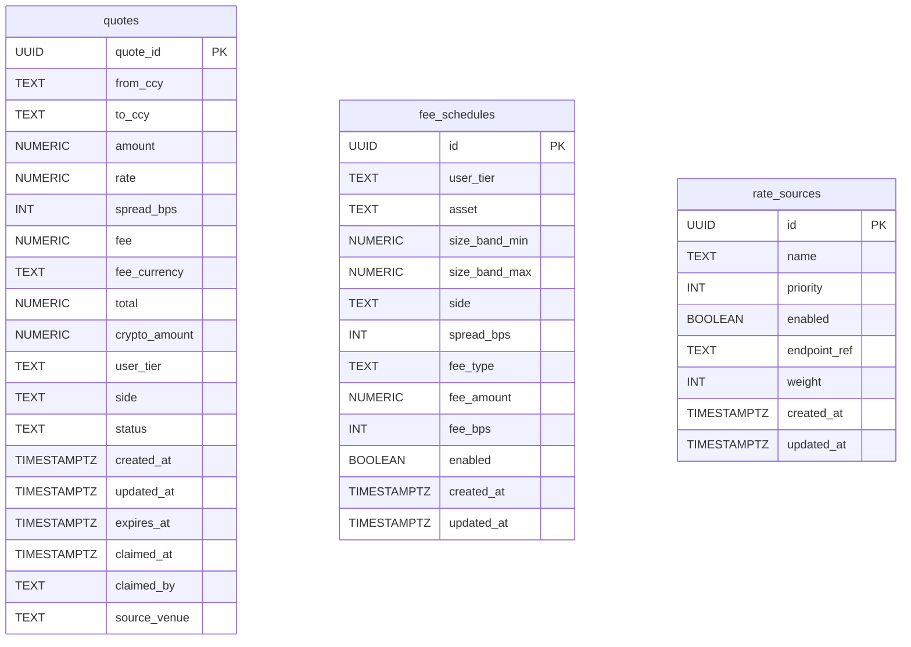
```mermaid
erDiagram
  quotes {
    UUID quote_id PK
    TEXT from_ccy
    TEXT to_ccy
    NUMERIC amount
    NUMERIC rate
    INT spread_bps
    NUMERIC fee
    TEXT fee_currency
    NUMERIC total
    NUMERIC crypto_amount
    TEXT user_tier
    TEXT side
    TEXT status
    TIMESTAMPTZ created_at
    TIMESTAMPTZ updated_at
    TIMESTAMPTZ expires_at
    TIMESTAMPTZ claimed_at
    TEXT claimed_by
    TEXT source_venue
  }
  fee_schedules {
    UUID id PK
    TEXT user_tier
    TEXT asset
    NUMERIC size_band_min
    NUMERIC size_band_max
    TEXT side
    INT spread_bps
    TEXT fee_type
    NUMERIC fee_amount
    INT fee_bps
    BOOLEAN enabled
    TIMESTAMPTZ created_at
    TIMESTAMPTZ updated_at
  }
  rate_sources {
    UUID id PK
    TEXT name
    INT priority
    BOOLEAN enabled
    TEXT endpoint_ref
    INT weight
    TIMESTAMPTZ created_at
    TIMESTAMPTZ updated_at
  }
```

**Cross-service logical references**
- `quotes.quote_id` — referenced by `orchestrator-tx.transactions.quote_id`
- `quotes.claimed_by -> gateway-auth.users.id`
- `rate_sources.name` — referenced by `engine-liquidity.child_orders.venue_id`, `gateway-exchange.orders.venue`, `fx-hedger.hedge_executions.venue`

---

## engine-recon

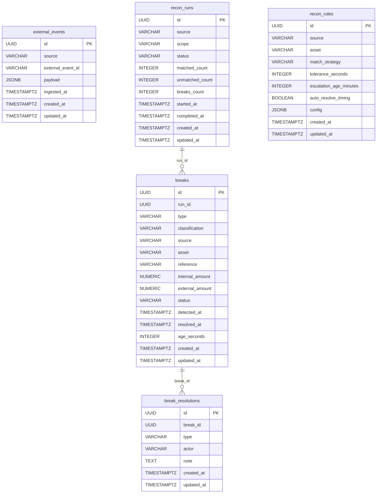
```mermaid
erDiagram
  external_events {
    UUID id PK
    VARCHAR source
    VARCHAR external_event_id
    JSONB payload
    TIMESTAMPTZ ingested_at
    TIMESTAMPTZ created_at
    TIMESTAMPTZ updated_at
  }
  recon_runs {
    UUID id PK
    VARCHAR source
    VARCHAR scope
    VARCHAR status
    INTEGER matched_count
    INTEGER unmatched_count
    INTEGER breaks_count
    TIMESTAMPTZ started_at
    TIMESTAMPTZ completed_at
    TIMESTAMPTZ created_at
    TIMESTAMPTZ updated_at
  }
  breaks {
    UUID id PK
    UUID run_id
    VARCHAR type
    VARCHAR classification
    VARCHAR source
    VARCHAR asset
    VARCHAR reference
    NUMERIC internal_amount
    NUMERIC external_amount
    VARCHAR status
    TIMESTAMPTZ detected_at
    TIMESTAMPTZ resolved_at
    INTEGER age_seconds
    TIMESTAMPTZ created_at
    TIMESTAMPTZ updated_at
  }
  break_resolutions {
    UUID id PK
    UUID break_id
    VARCHAR type
    VARCHAR actor
    TEXT note
    TIMESTAMPTZ created_at
    TIMESTAMPTZ updated_at
  }
  recon_rules {
    UUID id PK
    VARCHAR source
    VARCHAR asset
    VARCHAR match_strategy
    INTEGER tolerance_seconds
    INTEGER escalation_age_minutes
    BOOLEAN auto_resolve_timing
    JSONB config
    TIMESTAMPTZ created_at
    TIMESTAMPTZ updated_at
  }

  recon_runs ||--o{ breaks : "run_id"
  breaks ||--o{ break_resolutions : "break_id"
```

**Cross-service logical references**
- `breaks.reference -> orchestrator-tx.transactions.tx_id` / `orchestrator-fiat.intents.id` / `accounting-ledger.postings.posting_id` (depends on `source`)
- `break_resolutions.actor -> gateway-auth.users.id` (or `gateway-auth.roles.name`)

---

## fx-hedger

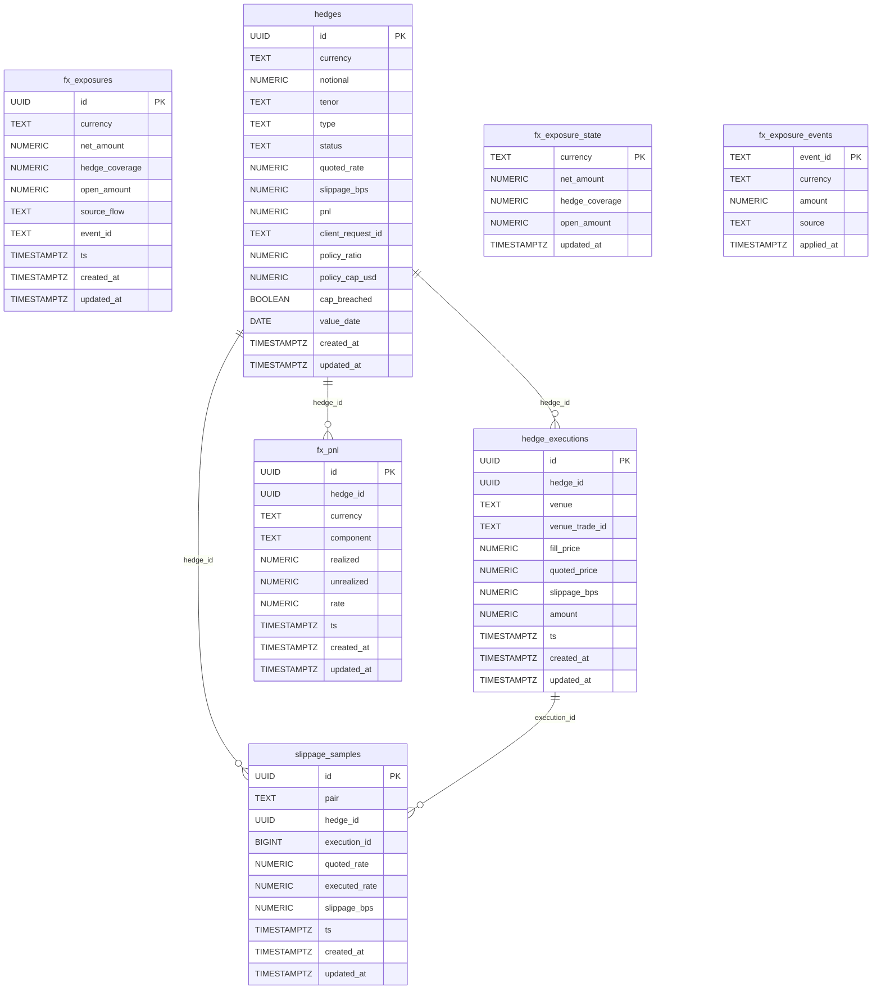
```mermaid
erDiagram
  fx_exposures {
    UUID id PK
    TEXT currency
    NUMERIC net_amount
    NUMERIC hedge_coverage
    NUMERIC open_amount
    TEXT source_flow
    TEXT event_id
    TIMESTAMPTZ ts
    TIMESTAMPTZ created_at
    TIMESTAMPTZ updated_at
  }
  hedges {
    UUID id PK
    TEXT currency
    NUMERIC notional
    TEXT tenor
    TEXT type
    TEXT status
    NUMERIC quoted_rate
    NUMERIC slippage_bps
    NUMERIC pnl
    TEXT client_request_id
    NUMERIC policy_ratio
    NUMERIC policy_cap_usd
    BOOLEAN cap_breached
    DATE value_date
    TIMESTAMPTZ created_at
    TIMESTAMPTZ updated_at
  }
  hedge_executions {
    UUID id PK
    UUID hedge_id
    TEXT venue
    TEXT venue_trade_id
    NUMERIC fill_price
    NUMERIC quoted_price
    NUMERIC slippage_bps
    NUMERIC amount
    TIMESTAMPTZ ts
    TIMESTAMPTZ created_at
    TIMESTAMPTZ updated_at
  }
  fx_pnl {
    UUID id PK
    UUID hedge_id
    TEXT currency
    TEXT component
    NUMERIC realized
    NUMERIC unrealized
    NUMERIC rate
    TIMESTAMPTZ ts
    TIMESTAMPTZ created_at
    TIMESTAMPTZ updated_at
  }
  slippage_samples {
    UUID id PK
    TEXT pair
    UUID hedge_id
    BIGINT execution_id
    NUMERIC quoted_rate
    NUMERIC executed_rate
    NUMERIC slippage_bps
    TIMESTAMPTZ ts
    TIMESTAMPTZ created_at
    TIMESTAMPTZ updated_at
  }
  fx_exposure_state {
    TEXT currency PK
    NUMERIC net_amount
    NUMERIC hedge_coverage
    NUMERIC open_amount
    TIMESTAMPTZ updated_at
  }
  fx_exposure_events {
    TEXT event_id PK
    TEXT currency
    NUMERIC amount
    TEXT source
    TIMESTAMPTZ applied_at
  }

  hedges ||--o{ hedge_executions : "hedge_id"
  hedges ||--o{ fx_pnl : "hedge_id"
  hedges ||--o{ slippage_samples : "hedge_id"
  hedge_executions ||--o{ slippage_samples : "execution_id"
```

**Cross-service logical references**
- `hedge_executions.venue -> engine-pricing.rate_sources.name` / `gateway-exchange.orders.venue`
- `fx_exposures.event_id -> outbox event from orchestrator-treasury / engine-liquidity`

---

## gateway-auth

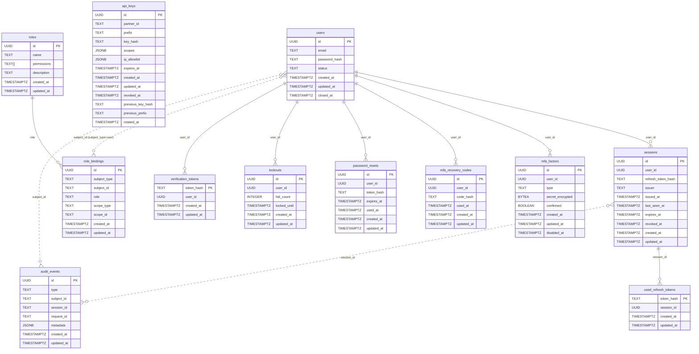
```mermaid
erDiagram
  users {
    UUID id PK
    TEXT email
    TEXT password_hash
    TEXT status
    TIMESTAMPTZ created_at
    TIMESTAMPTZ updated_at
    TIMESTAMPTZ closed_at
  }
  sessions {
    UUID id PK
    UUID user_id
    TEXT refresh_token_hash
    TEXT issuer
    TIMESTAMPTZ issued_at
    TIMESTAMPTZ last_seen_at
    TIMESTAMPTZ expires_at
    TIMESTAMPTZ revoked_at
    TIMESTAMPTZ created_at
    TIMESTAMPTZ updated_at
  }
  mfa_factors {
    UUID id PK
    UUID user_id
    TEXT type
    BYTEA secret_encrypted
    BOOLEAN confirmed
    TIMESTAMPTZ created_at
    TIMESTAMPTZ updated_at
    TIMESTAMPTZ disabled_at
  }
  mfa_recovery_codes {
    UUID id PK
    UUID user_id
    TEXT code_hash
    TIMESTAMPTZ used_at
    TIMESTAMPTZ created_at
    TIMESTAMPTZ updated_at
  }
  api_keys {
    UUID id PK
    TEXT partner_id
    TEXT prefix
    TEXT key_hash
    JSONB scopes
    JSONB ip_allowlist
    TIMESTAMPTZ expires_at
    TIMESTAMPTZ created_at
    TIMESTAMPTZ updated_at
    TIMESTAMPTZ revoked_at
    TEXT previous_key_hash
    TEXT previous_prefix
    TIMESTAMPTZ rotated_at
  }
  roles {
    UUID id PK
    TEXT name
    TEXT[] permissions
    TEXT description
    TIMESTAMPTZ created_at
    TIMESTAMPTZ updated_at
  }
  role_bindings {
    UUID id PK
    TEXT subject_type
    TEXT subject_id
    TEXT role
    TEXT scope_type
    TEXT scope_id
    TIMESTAMPTZ created_at
    TIMESTAMPTZ updated_at
  }
  password_resets {
    UUID id PK
    UUID user_id
    TEXT token_hash
    TIMESTAMPTZ expires_at
    TIMESTAMPTZ used_at
    TIMESTAMPTZ created_at
    TIMESTAMPTZ updated_at
  }
  lockouts {
    UUID id PK
    UUID user_id
    INTEGER fail_count
    TIMESTAMPTZ locked_until
    TIMESTAMPTZ created_at
    TIMESTAMPTZ updated_at
  }
  audit_events {
    UUID id PK
    TEXT type
    TEXT subject_id
    TEXT session_id
    TEXT request_id
    JSONB metadata
    TIMESTAMPTZ created_at
    TIMESTAMPTZ updated_at
  }
  verification_tokens {
    TEXT token_hash PK
    UUID user_id
    TIMESTAMPTZ created_at
    TIMESTAMPTZ updated_at
  }
  used_refresh_tokens {
    TEXT token_hash PK
    UUID session_id
    TIMESTAMPTZ created_at
    TIMESTAMPTZ updated_at
  }

  users ||--o{ sessions : "user_id"
  users ||--o{ mfa_factors : "user_id"
  users ||--o{ mfa_recovery_codes : "user_id"
  users ||--o{ password_resets : "user_id"
  users ||--o{ lockouts : "user_id"
  users ||--o{ verification_tokens : "user_id"
  sessions ||--o{ used_refresh_tokens : "session_id"
  roles ||--o{ role_bindings : "role"
  users }o..o{ role_bindings : "subject_id (subject_type=user)"
  users }o..o{ audit_events : "subject_id"
  sessions }o..o{ audit_events : "session_id"
```

**Cross-service logical references**
- `users.id` — canonical identity, referenced widely (see [combined diagram](#combined-cross-service-diagram))
- `role_bindings.subject_id -> users.id` (when `subject_type='user'`)
- `audit_events -> audit-logger.audit_events` (via outbox)

---

## gateway-blockchain

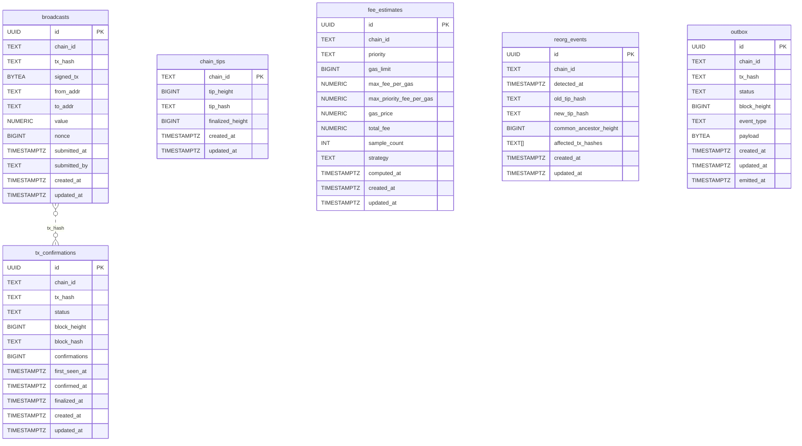
```mermaid
erDiagram
  broadcasts {
    UUID id PK
    TEXT chain_id
    TEXT tx_hash
    BYTEA signed_tx
    TEXT from_addr
    TEXT to_addr
    NUMERIC value
    BIGINT nonce
    TIMESTAMPTZ submitted_at
    TEXT submitted_by
    TIMESTAMPTZ created_at
    TIMESTAMPTZ updated_at
  }
  tx_confirmations {
    UUID id PK
    TEXT chain_id
    TEXT tx_hash
    TEXT status
    BIGINT block_height
    TEXT block_hash
    BIGINT confirmations
    TIMESTAMPTZ first_seen_at
    TIMESTAMPTZ confirmed_at
    TIMESTAMPTZ finalized_at
    TIMESTAMPTZ created_at
    TIMESTAMPTZ updated_at
  }
  chain_tips {
    TEXT chain_id PK
    BIGINT tip_height
    TEXT tip_hash
    BIGINT finalized_height
    TIMESTAMPTZ created_at
    TIMESTAMPTZ updated_at
  }
  fee_estimates {
    UUID id PK
    TEXT chain_id
    TEXT priority
    BIGINT gas_limit
    NUMERIC max_fee_per_gas
    NUMERIC max_priority_fee_per_gas
    NUMERIC gas_price
    NUMERIC total_fee
    INT sample_count
    TEXT strategy
    TIMESTAMPTZ computed_at
    TIMESTAMPTZ created_at
    TIMESTAMPTZ updated_at
  }
  reorg_events {
    UUID id PK
    TEXT chain_id
    TIMESTAMPTZ detected_at
    TEXT old_tip_hash
    TEXT new_tip_hash
    BIGINT common_ancestor_height
    TEXT[] affected_tx_hashes
    TIMESTAMPTZ created_at
    TIMESTAMPTZ updated_at
  }
  outbox {
    UUID id PK
    TEXT chain_id
    TEXT tx_hash
    TEXT status
    BIGINT block_height
    TEXT event_type
    BYTEA payload
    TIMESTAMPTZ created_at
    TIMESTAMPTZ updated_at
    TIMESTAMPTZ emitted_at
  }

  broadcasts }o..o{ tx_confirmations : "tx_hash"
```

**Cross-service logical references**
- `broadcasts.tx_hash` — referenced by `wallet-manager.withdrawal_requests.tx_hash`, `wallet-manager.utxos.tx_hash`
- `broadcasts.submitted_by -> gateway-auth.users.id`

---

## gateway-exchange

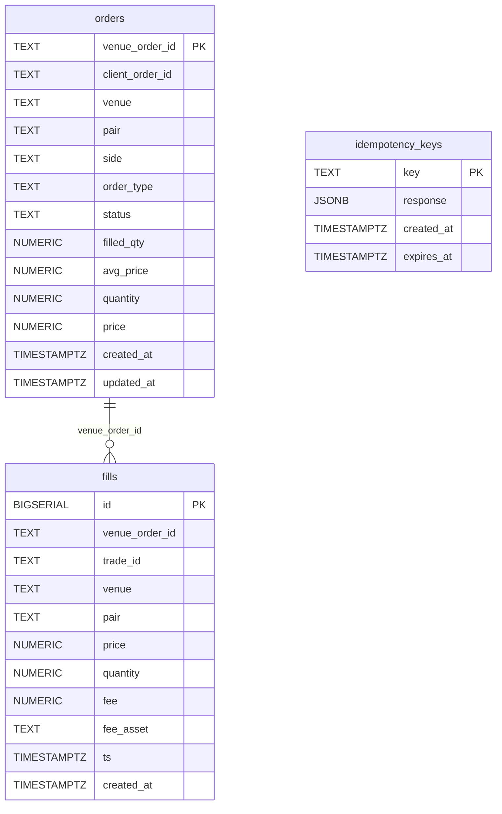
```mermaid
erDiagram
  orders {
    TEXT venue_order_id PK
    TEXT client_order_id
    TEXT venue
    TEXT pair
    TEXT side
    TEXT order_type
    TEXT status
    NUMERIC filled_qty
    NUMERIC avg_price
    NUMERIC quantity
    NUMERIC price
    TIMESTAMPTZ created_at
    TIMESTAMPTZ updated_at
  }
  fills {
    BIGSERIAL id PK
    TEXT venue_order_id
    TEXT trade_id
    TEXT venue
    TEXT pair
    NUMERIC price
    NUMERIC quantity
    NUMERIC fee
    TEXT fee_asset
    TIMESTAMPTZ ts
    TIMESTAMPTZ created_at
  }
  idempotency_keys {
    TEXT key PK
    JSONB response
    TIMESTAMPTZ created_at
    TIMESTAMPTZ expires_at
  }

  orders ||--o{ fills : "venue_order_id"
```

**Cross-service logical references**
- `orders.client_order_id -> engine-liquidity.child_orders.idempotency_key` / `parent_orders.client_request_id`
- `orders.venue -> engine-pricing.rate_sources.name`
- `fills` mirror `engine-liquidity.fills` (same domain)

---

## gateway-fiat

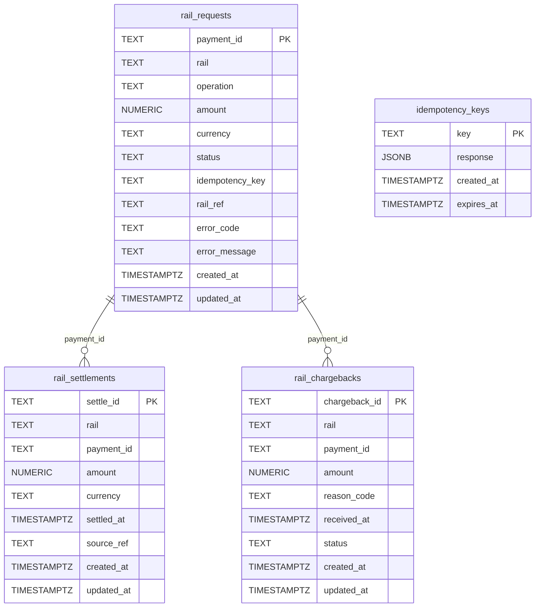
```mermaid
erDiagram
  rail_requests {
    TEXT payment_id PK
    TEXT rail
    TEXT operation
    NUMERIC amount
    TEXT currency
    TEXT status
    TEXT idempotency_key
    TEXT rail_ref
    TEXT error_code
    TEXT error_message
    TIMESTAMPTZ created_at
    TIMESTAMPTZ updated_at
  }
  rail_settlements {
    TEXT settle_id PK
    TEXT rail
    TEXT payment_id
    NUMERIC amount
    TEXT currency
    TIMESTAMPTZ settled_at
    TEXT source_ref
    TIMESTAMPTZ created_at
    TIMESTAMPTZ updated_at
  }
  rail_chargebacks {
    TEXT chargeback_id PK
    TEXT rail
    TEXT payment_id
    NUMERIC amount
    TEXT reason_code
    TIMESTAMPTZ received_at
    TEXT status
    TIMESTAMPTZ created_at
    TIMESTAMPTZ updated_at
  }
  idempotency_keys {
    TEXT key PK
    JSONB response
    TIMESTAMPTZ created_at
    TIMESTAMPTZ expires_at
  }

  rail_requests ||--o{ rail_settlements : "payment_id"
  rail_requests ||--o{ rail_chargebacks : "payment_id"
```

**Cross-service logical references**
- `rail_requests.payment_id -> orchestrator-fiat.intents.id`
- `rail_settlements.payment_id -> rail_requests.payment_id`
- `rail_chargebacks.payment_id -> rail_requests.payment_id`

---

## kyc-onboarding

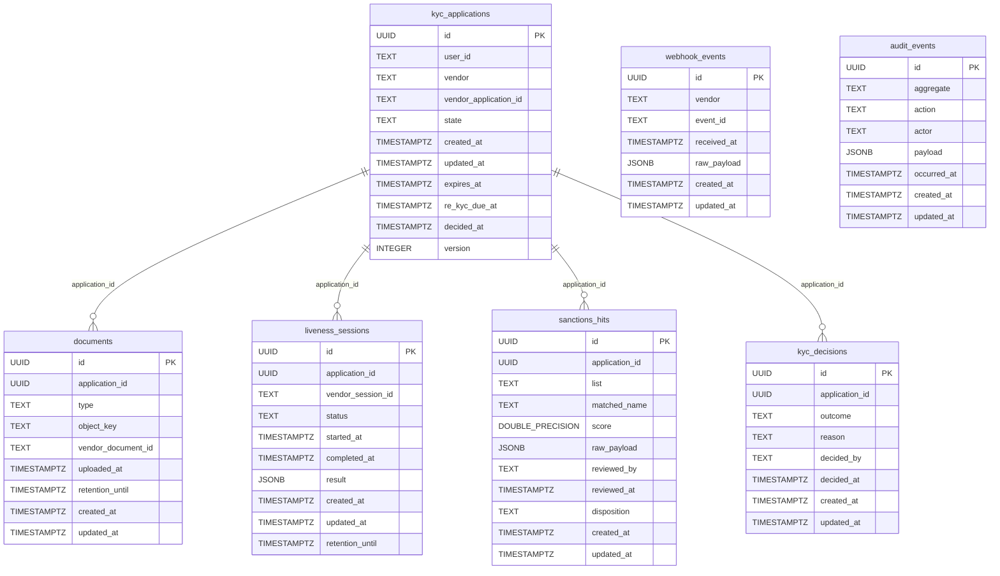
```mermaid
erDiagram
  kyc_applications {
    UUID id PK
    TEXT user_id
    TEXT vendor
    TEXT vendor_application_id
    TEXT state
    TIMESTAMPTZ created_at
    TIMESTAMPTZ updated_at
    TIMESTAMPTZ expires_at
    TIMESTAMPTZ re_kyc_due_at
    TIMESTAMPTZ decided_at
    INTEGER version
  }
  documents {
    UUID id PK
    UUID application_id
    TEXT type
    TEXT object_key
    TEXT vendor_document_id
    TIMESTAMPTZ uploaded_at
    TIMESTAMPTZ retention_until
    TIMESTAMPTZ created_at
    TIMESTAMPTZ updated_at
  }
  liveness_sessions {
    UUID id PK
    UUID application_id
    TEXT vendor_session_id
    TEXT status
    TIMESTAMPTZ started_at
    TIMESTAMPTZ completed_at
    JSONB result
    TIMESTAMPTZ created_at
    TIMESTAMPTZ updated_at
    TIMESTAMPTZ retention_until
  }
  sanctions_hits {
    UUID id PK
    UUID application_id
    TEXT list
    TEXT matched_name
    DOUBLE_PRECISION score
    JSONB raw_payload
    TEXT reviewed_by
    TIMESTAMPTZ reviewed_at
    TEXT disposition
    TIMESTAMPTZ created_at
    TIMESTAMPTZ updated_at
  }
  kyc_decisions {
    UUID id PK
    UUID application_id
    TEXT outcome
    TEXT reason
    TEXT decided_by
    TIMESTAMPTZ decided_at
    TIMESTAMPTZ created_at
    TIMESTAMPTZ updated_at
  }
  webhook_events {
    UUID id PK
    TEXT vendor
    TEXT event_id
    TIMESTAMPTZ received_at
    JSONB raw_payload
    TIMESTAMPTZ created_at
    TIMESTAMPTZ updated_at
  }
  audit_events {
    UUID id PK
    TEXT aggregate
    TEXT action
    TEXT actor
    JSONB payload
    TIMESTAMPTZ occurred_at
    TIMESTAMPTZ created_at
    TIMESTAMPTZ updated_at
  }

  kyc_applications ||--o{ documents : "application_id"
  kyc_applications ||--o{ liveness_sessions : "application_id"
  kyc_applications ||--o{ sanctions_hits : "application_id"
  kyc_applications ||--o{ kyc_decisions : "application_id"
```

**Cross-service logical references**
- `kyc_applications.user_id -> gateway-auth.users.id`
- `kyc_decisions.decided_by -> gateway-auth.users.id`
- `sanctions_hits.reviewed_by -> gateway-auth.users.id`
- `audit_events -> audit-logger.audit_events` (via outbox)

---

## kyt-aml-screening

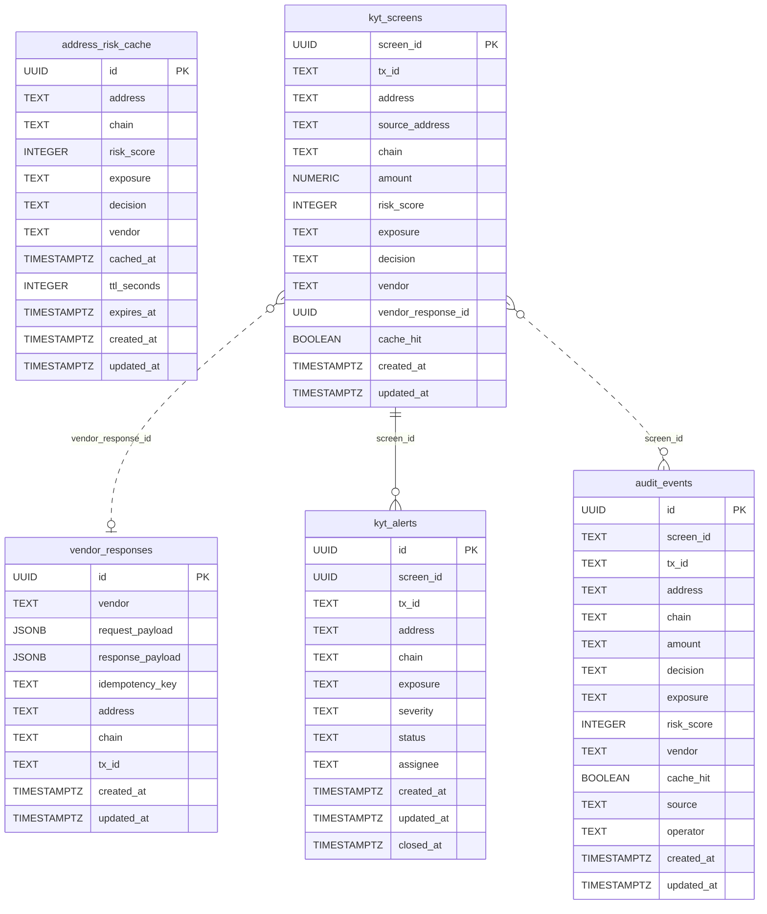
```mermaid
erDiagram
  address_risk_cache {
    UUID id PK
    TEXT address
    TEXT chain
    INTEGER risk_score
    TEXT exposure
    TEXT decision
    TEXT vendor
    TIMESTAMPTZ cached_at
    INTEGER ttl_seconds
    TIMESTAMPTZ expires_at
    TIMESTAMPTZ created_at
    TIMESTAMPTZ updated_at
  }
  kyt_screens {
    UUID screen_id PK
    TEXT tx_id
    TEXT address
    TEXT source_address
    TEXT chain
    NUMERIC amount
    INTEGER risk_score
    TEXT exposure
    TEXT decision
    TEXT vendor
    UUID vendor_response_id
    BOOLEAN cache_hit
    TIMESTAMPTZ created_at
    TIMESTAMPTZ updated_at
  }
  kyt_alerts {
    UUID id PK
    UUID screen_id
    TEXT tx_id
    TEXT address
    TEXT chain
    TEXT exposure
    TEXT severity
    TEXT status
    TEXT assignee
    TIMESTAMPTZ created_at
    TIMESTAMPTZ updated_at
    TIMESTAMPTZ closed_at
  }
  vendor_responses {
    UUID id PK
    TEXT vendor
    JSONB request_payload
    JSONB response_payload
    TEXT idempotency_key
    TEXT address
    TEXT chain
    TEXT tx_id
    TIMESTAMPTZ created_at
    TIMESTAMPTZ updated_at
  }
  audit_events {
    UUID id PK
    TEXT screen_id
    TEXT tx_id
    TEXT address
    TEXT chain
    TEXT amount
    TEXT decision
    TEXT exposure
    INTEGER risk_score
    TEXT vendor
    BOOLEAN cache_hit
    TEXT source
    TEXT operator
    TIMESTAMPTZ created_at
    TIMESTAMPTZ updated_at
  }

  kyt_screens }o..o| vendor_responses : "vendor_response_id"
  kyt_screens ||--o{ kyt_alerts : "screen_id"
  kyt_screens }o..o{ audit_events : "screen_id"
```

**Cross-service logical references**
- `kyt_screens.tx_id -> orchestrator-tx.transactions.tx_id`
- `kyt_screens.address -> wallet-manager.addresses.address`
- `vendor_responses.tx_id -> orchestrator-tx.transactions.tx_id`
- `kyt_alerts.assignee -> gateway-auth.users.id`
- `address_risk_cache.address -> wallet-manager.addresses.address`

---

## notifier

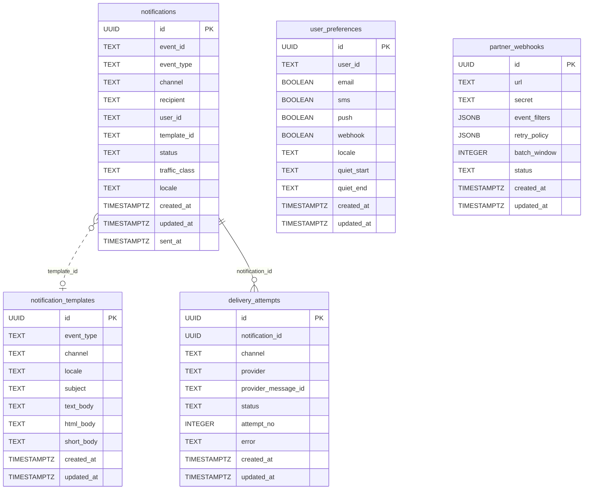
```mermaid
erDiagram
  notifications {
    UUID id PK
    TEXT event_id
    TEXT event_type
    TEXT channel
    TEXT recipient
    TEXT user_id
    TEXT template_id
    TEXT status
    TEXT traffic_class
    TEXT locale
    TIMESTAMPTZ created_at
    TIMESTAMPTZ updated_at
    TIMESTAMPTZ sent_at
  }
  notification_templates {
    UUID id PK
    TEXT event_type
    TEXT channel
    TEXT locale
    TEXT subject
    TEXT text_body
    TEXT html_body
    TEXT short_body
    TIMESTAMPTZ created_at
    TIMESTAMPTZ updated_at
  }
  delivery_attempts {
    UUID id PK
    UUID notification_id
    TEXT channel
    TEXT provider
    TEXT provider_message_id
    TEXT status
    INTEGER attempt_no
    TEXT error
    TIMESTAMPTZ created_at
    TIMESTAMPTZ updated_at
  }
  user_preferences {
    UUID id PK
    TEXT user_id
    BOOLEAN email
    BOOLEAN sms
    BOOLEAN push
    BOOLEAN webhook
    TEXT locale
    TEXT quiet_start
    TEXT quiet_end
    TIMESTAMPTZ created_at
    TIMESTAMPTZ updated_at
  }
  partner_webhooks {
    UUID id PK
    TEXT url
    TEXT secret
    JSONB event_filters
    JSONB retry_policy
    INTEGER batch_window
    TEXT status
    TIMESTAMPTZ created_at
    TIMESTAMPTZ updated_at
  }

  notifications }o..o| notification_templates : "template_id"
  notifications ||--o{ delivery_attempts : "notification_id"
```

**Cross-service logical references**
- `notifications.user_id -> gateway-auth.users.id`
- `notifications.event_id -> orchestrator-tx.transactions.tx_id` (transaction lifecycle events)
- `user_preferences.user_id -> gateway-auth.users.id`

---

## orchestrator-fiat

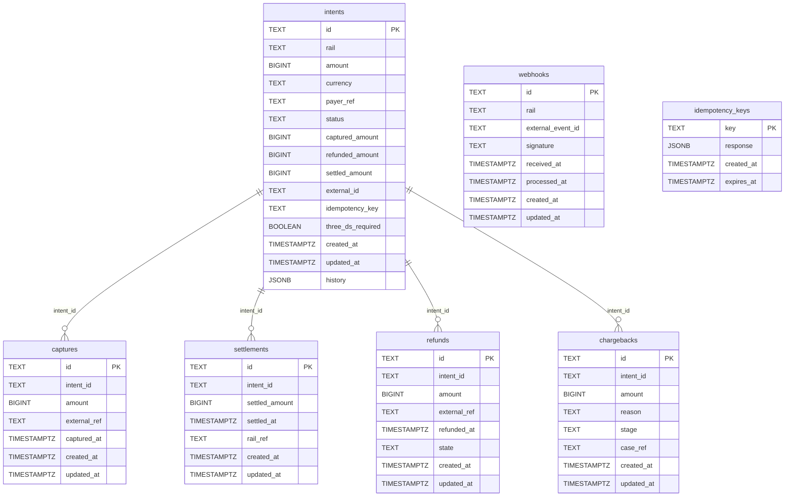
```mermaid
erDiagram
  intents {
    TEXT id PK
    TEXT rail
    BIGINT amount
    TEXT currency
    TEXT payer_ref
    TEXT status
    BIGINT captured_amount
    BIGINT refunded_amount
    BIGINT settled_amount
    TEXT external_id
    TEXT idempotency_key
    BOOLEAN three_ds_required
    TIMESTAMPTZ created_at
    TIMESTAMPTZ updated_at
    JSONB history
  }
  captures {
    TEXT id PK
    TEXT intent_id
    BIGINT amount
    TEXT external_ref
    TIMESTAMPTZ captured_at
    TIMESTAMPTZ created_at
    TIMESTAMPTZ updated_at
  }
  settlements {
    TEXT id PK
    TEXT intent_id
    BIGINT settled_amount
    TIMESTAMPTZ settled_at
    TEXT rail_ref
    TIMESTAMPTZ created_at
    TIMESTAMPTZ updated_at
  }
  refunds {
    TEXT id PK
    TEXT intent_id
    BIGINT amount
    TEXT external_ref
    TIMESTAMPTZ refunded_at
    TEXT state
    TIMESTAMPTZ created_at
    TIMESTAMPTZ updated_at
  }
  chargebacks {
    TEXT id PK
    TEXT intent_id
    BIGINT amount
    TEXT reason
    TEXT stage
    TEXT case_ref
    TIMESTAMPTZ created_at
    TIMESTAMPTZ updated_at
  }
  webhooks {
    TEXT id PK
    TEXT rail
    TEXT external_event_id
    TEXT signature
    TIMESTAMPTZ received_at
    TIMESTAMPTZ processed_at
    TIMESTAMPTZ created_at
    TIMESTAMPTZ updated_at
  }
  idempotency_keys {
    TEXT key PK
    JSONB response
    TIMESTAMPTZ created_at
    TIMESTAMPTZ expires_at
  }

  intents ||--o{ captures : "intent_id"
  intents ||--o{ settlements : "intent_id"
  intents ||--o{ refunds : "intent_id"
  intents ||--o{ chargebacks : "intent_id"
```

**Cross-service logical references**
- `intents.id -> gateway-fiat.rail_requests.payment_id`
- `intents.payer_ref -> gateway-auth.users.id` (likely)
- `chargebacks -> engine-fraud.chargeback_events` (via intent_id / tx_id)
- `intents.id -> engine-recon.breaks.reference` (when source is fiat rail)

---

## orchestrator-treasury

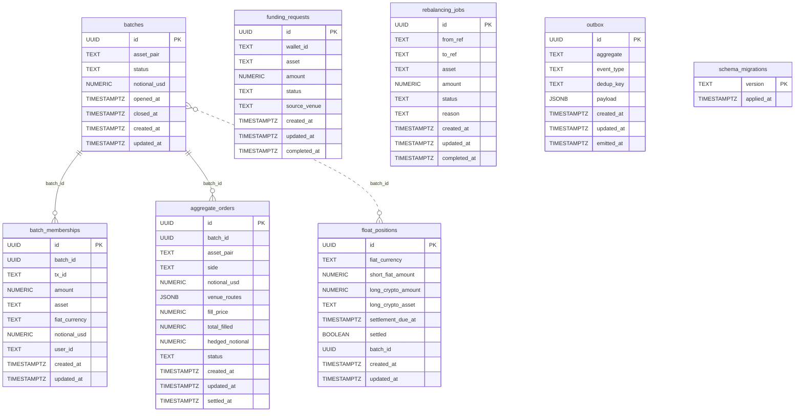
```mermaid
erDiagram
  batches {
    UUID id PK
    TEXT asset_pair
    TEXT status
    NUMERIC notional_usd
    TIMESTAMPTZ opened_at
    TIMESTAMPTZ closed_at
    TIMESTAMPTZ created_at
    TIMESTAMPTZ updated_at
  }
  batch_memberships {
    UUID id PK
    UUID batch_id
    TEXT tx_id
    NUMERIC amount
    TEXT asset
    TEXT fiat_currency
    NUMERIC notional_usd
    TEXT user_id
    TIMESTAMPTZ created_at
    TIMESTAMPTZ updated_at
  }
  aggregate_orders {
    UUID id PK
    UUID batch_id
    TEXT asset_pair
    TEXT side
    NUMERIC notional_usd
    JSONB venue_routes
    NUMERIC fill_price
    NUMERIC total_filled
    NUMERIC hedged_notional
    TEXT status
    TIMESTAMPTZ created_at
    TIMESTAMPTZ updated_at
    TIMESTAMPTZ settled_at
  }
  funding_requests {
    UUID id PK
    TEXT wallet_id
    TEXT asset
    NUMERIC amount
    TEXT status
    TEXT source_venue
    TIMESTAMPTZ created_at
    TIMESTAMPTZ updated_at
    TIMESTAMPTZ completed_at
  }
  float_positions {
    UUID id PK
    TEXT fiat_currency
    NUMERIC short_fiat_amount
    NUMERIC long_crypto_amount
    TEXT long_crypto_asset
    TIMESTAMPTZ settlement_due_at
    BOOLEAN settled
    UUID batch_id
    TIMESTAMPTZ created_at
    TIMESTAMPTZ updated_at
  }
  rebalancing_jobs {
    UUID id PK
    TEXT from_ref
    TEXT to_ref
    TEXT asset
    NUMERIC amount
    TEXT status
    TEXT reason
    TIMESTAMPTZ created_at
    TIMESTAMPTZ updated_at
    TIMESTAMPTZ completed_at
  }
  outbox {
    UUID id PK
    TEXT aggregate
    TEXT event_type
    TEXT dedup_key
    JSONB payload
    TIMESTAMPTZ created_at
    TIMESTAMPTZ updated_at
    TIMESTAMPTZ emitted_at
  }
  schema_migrations {
    TEXT version PK
    TIMESTAMPTZ applied_at
  }

  batches ||--o{ batch_memberships : "batch_id"
  batches ||--o{ aggregate_orders : "batch_id"
  batches }o..o{ float_positions : "batch_id"
```

**Cross-service logical references**
- `batch_memberships.tx_id -> orchestrator-tx.transactions.tx_id`
- `batch_memberships.user_id -> gateway-auth.users.id`
- `funding_requests.wallet_id -> wallet-manager.wallets.id`
- `aggregate_orders.id -> engine-liquidity.parent_orders.id` (likely)
- `outbox -> audit-logger.audit_events`

---

## orchestrator-tx

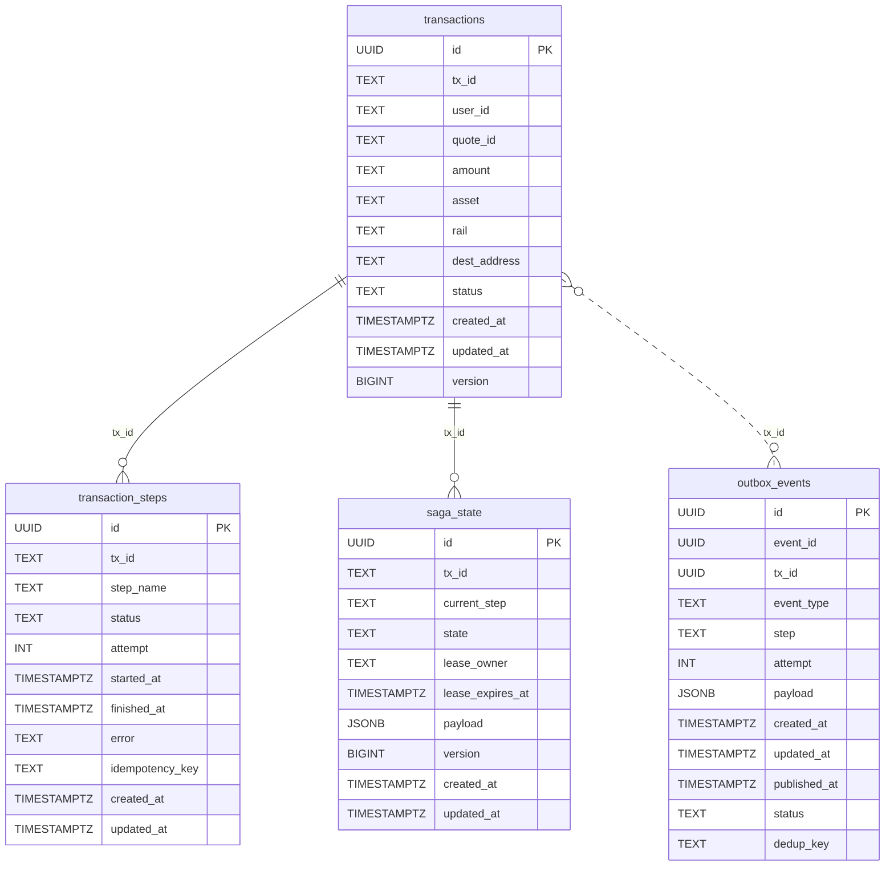
```mermaid
erDiagram
  transactions {
    UUID id PK
    TEXT tx_id
    TEXT user_id
    TEXT quote_id
    TEXT amount
    TEXT asset
    TEXT rail
    TEXT dest_address
    TEXT status
    TIMESTAMPTZ created_at
    TIMESTAMPTZ updated_at
    BIGINT version
  }
  transaction_steps {
    UUID id PK
    TEXT tx_id
    TEXT step_name
    TEXT status
    INT attempt
    TIMESTAMPTZ started_at
    TIMESTAMPTZ finished_at
    TEXT error
    TEXT idempotency_key
    TIMESTAMPTZ created_at
    TIMESTAMPTZ updated_at
  }
  saga_state {
    UUID id PK
    TEXT tx_id
    TEXT current_step
    TEXT state
    TEXT lease_owner
    TIMESTAMPTZ lease_expires_at
    JSONB payload
    BIGINT version
    TIMESTAMPTZ created_at
    TIMESTAMPTZ updated_at
  }
  outbox_events {
    UUID id PK
    UUID event_id
    UUID tx_id
    TEXT event_type
    TEXT step
    INT attempt
    JSONB payload
    TIMESTAMPTZ created_at
    TIMESTAMPTZ updated_at
    TIMESTAMPTZ published_at
    TEXT status
    TEXT dedup_key
  }

  transactions ||--o{ transaction_steps : "tx_id"
  transactions ||--o{ saga_state : "tx_id"
  transactions }o..o{ outbox_events : "tx_id"
```

**Cross-service logical references**
- `transactions.user_id -> gateway-auth.users.id`
- `transactions.quote_id -> engine-pricing.quotes.quote_id`
- `transactions.dest_address -> wallet-manager.addresses.address`
- `transactions.tx_id` — referenced widely (see [combined diagram](#combined-cross-service-diagram))

---

## wallet-manager

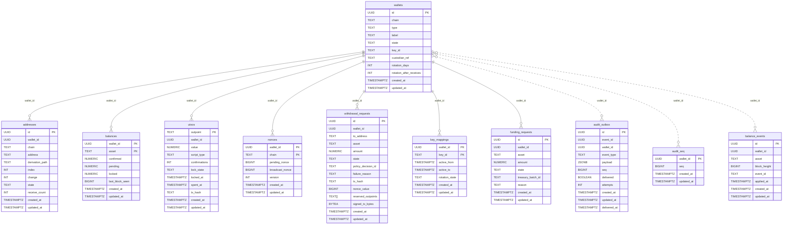
```mermaid
erDiagram
  wallets {
    UUID id PK
    TEXT chain
    TEXT type
    TEXT label
    TEXT state
    TEXT key_id
    TEXT custodian_ref
    INT rotation_days
    INT rotation_after_receives
    TIMESTAMPTZ created_at
    TIMESTAMPTZ updated_at
  }
  addresses {
    UUID id PK
    UUID wallet_id
    TEXT chain
    TEXT address
    TEXT derivation_path
    INT index
    INT change
    TEXT state
    INT receive_count
    TIMESTAMPTZ created_at
    TIMESTAMPTZ updated_at
  }
  balances {
    UUID wallet_id PK
    TEXT asset PK
    NUMERIC confirmed
    NUMERIC pending
    NUMERIC locked
    BIGINT last_block_seen
    TIMESTAMPTZ created_at
    TIMESTAMPTZ updated_at
  }
  utxos {
    TEXT outpoint PK
    UUID wallet_id
    NUMERIC value
    TEXT script_type
    INT confirmations
    TEXT lock_state
    TIMESTAMPTZ locked_at
    TIMESTAMPTZ spent_at
    TEXT tx_hash
    TIMESTAMPTZ created_at
    TIMESTAMPTZ updated_at
  }
  nonces {
    UUID wallet_id PK
    TEXT chain PK
    BIGINT pending_nonce
    BIGINT broadcast_nonce
    INT version
    TIMESTAMPTZ created_at
    TIMESTAMPTZ updated_at
  }
  withdrawal_requests {
    UUID id PK
    UUID wallet_id
    TEXT to_address
    TEXT asset
    NUMERIC amount
    TEXT state
    TEXT policy_decision_id
    TEXT failure_reason
    TEXT tx_hash
    BIGINT nonce_value
    TEXT[] reserved_outpoints
    BYTEA signed_tx_bytes
    TIMESTAMPTZ created_at
    TIMESTAMPTZ updated_at
  }
  key_mappings {
    UUID wallet_id PK
    TEXT key_id PK
    TIMESTAMPTZ active_from
    TIMESTAMPTZ active_to
    TEXT rotation_state
    TIMESTAMPTZ created_at
    TIMESTAMPTZ updated_at
  }
  funding_requests {
    UUID id PK
    UUID wallet_id
    TEXT asset
    NUMERIC amount
    TEXT state
    TEXT treasury_batch_id
    TEXT reason
    TIMESTAMPTZ created_at
    TIMESTAMPTZ updated_at
  }
  audit_outbox {
    UUID id PK
    UUID event_id
    UUID wallet_id
    TEXT event_type
    JSONB payload
    BIGINT seq
    BOOLEAN delivered
    INT attempts
    TIMESTAMPTZ created_at
    TIMESTAMPTZ updated_at
    TIMESTAMPTZ delivered_at
  }
  audit_seq {
    UUID wallet_id PK
    BIGINT seq
    TIMESTAMPTZ created_at
    TIMESTAMPTZ updated_at
  }
  balance_events {
    UUID id PK
    UUID wallet_id
    TEXT asset
    BIGINT block_height
    TEXT event_id
    TIMESTAMPTZ applied_at
    TIMESTAMPTZ created_at
    TIMESTAMPTZ updated_at
  }

  wallets ||--o{ addresses : "wallet_id"
  wallets ||--o{ balances : "wallet_id"
  wallets ||--o{ utxos : "wallet_id"
  wallets ||--o{ nonces : "wallet_id"
  wallets ||--o{ withdrawal_requests : "wallet_id"
  wallets ||--o{ key_mappings : "wallet_id"
  wallets ||--o{ funding_requests : "wallet_id"
  wallets }o..o{ audit_outbox : "wallet_id"
  wallets }o..o{ audit_seq : "wallet_id"
  wallets }o..o{ balance_events : "wallet_id"
```

**Cross-service logical references**
- `wallets.id` — referenced by `orchestrator-treasury.funding_requests.wallet_id`
- `addresses.address` — referenced by `orchestrator-tx.transactions.dest_address`, `kyt-aml-screening.kyt_screens.address`, `engine-policy-risk.whitelist_addresses.address`
- `withdrawal_requests.policy_decision_id -> engine-policy-risk.policy_decisions.decision_id`
- `withdrawal_requests.tx_hash -> gateway-blockchain.broadcasts.tx_hash`
- `funding_requests.treasury_batch_id -> orchestrator-treasury.batches.id`
- `audit_outbox -> audit-logger.audit_events`

---

## Combined cross-service diagram

The diagram below renders each service as a cluster and shows the **logical** relationships that connect tables across services. Solid edges are intra-service foreign keys; dotted edges are cross-service logical references (no DB-level constraint, since services own independent schemas). Only the central entity tables are shown per service for readability — full per-table detail is in each service section above.

```mermaid
erDiagram
  %% ---- gateway-auth ----
  ga_users {
    UUID id PK
    TEXT email
  }
  ga_roles {
    UUID id PK
    TEXT name
  }
  ga_sessions {
    UUID id PK
    UUID user_id
  }

  %% ---- orchestrator-tx ----
  otx_transactions {
    UUID id PK
    TEXT tx_id
    TEXT user_id
    TEXT quote_id
    TEXT dest_address
  }

  %% ---- engine-pricing ----
  ep_quotes {
    UUID quote_id PK
    TEXT claimed_by
  }
  ep_rate_sources {
    UUID id PK
    TEXT name
  }

  %% ---- wallet-manager ----
  wm_wallets {
    UUID id PK
  }
  wm_addresses {
    UUID id PK
    UUID wallet_id
    TEXT address
  }
  wm_withdrawal_requests {
    UUID id PK
    UUID wallet_id
    TEXT policy_decision_id
    TEXT tx_hash
  }
  wm_funding_requests {
    UUID id PK
    UUID wallet_id
    TEXT treasury_batch_id
  }

  %% ---- orchestrator-treasury ----
  ot_batches {
    UUID id PK
  }
  ot_batch_memberships {
    UUID id PK
    UUID batch_id
    TEXT tx_id
    TEXT user_id
  }
  ot_aggregate_orders {
    UUID id PK
    UUID batch_id
  }
  ot_funding_requests {
    UUID id PK
    TEXT wallet_id
  }

  %% ---- engine-liquidity ----
  el_parent_orders {
    UUID id PK
  }
  el_child_orders {
    UUID id PK
    UUID parent_order_id
    TEXT venue_id
  }
  el_fills {
    UUID id PK
    TEXT venue_order_id
  }

  %% ---- engine-policy-risk ----
  epr_policy_decisions {
    TEXT decision_id PK
  }
  epr_whitelist_addresses {
    UUID id PK
    TEXT user_id
    TEXT address
  }
  epr_review_queue {
    UUID id PK
    TEXT tx_id
  }

  %% ---- engine-fraud ----
  ef_fraud_scores {
    UUID id PK
    TEXT tx_id
    TEXT user_id
  }
  ef_chargeback_events {
    UUID id PK
    TEXT tx_id
  }

  %% ---- kyt-aml-screening ----
  kyt_screens {
    UUID screen_id PK
    TEXT tx_id
    TEXT address
  }
  kyt_alerts {
    UUID id PK
    UUID screen_id
    TEXT assignee
  }

  %% ---- kyc-onboarding ----
  kyc_applications {
    UUID id PK
    TEXT user_id
  }

  %% ---- notifier ----
  not_notifications {
    UUID id PK
    TEXT user_id
    TEXT event_id
  }
  not_user_preferences {
    UUID id PK
    TEXT user_id
  }

  %% ---- accounting-ledger ----
  al_postings {
    TEXT posting_id PK
    TEXT ref_tx_id
  }

  %% ---- engine-recon ----
  er_breaks {
    UUID id PK
    TEXT reference
  }

  %% ---- audit-logger ----
  al_audit_events {
    UUID id PK
    TEXT actor_id
    TEXT source_service
  }

  %% ---- orchestrator-fiat ----
  of_intents {
    TEXT id PK
    TEXT payer_ref
  }
  of_chargebacks {
    TEXT id PK
    TEXT intent_id
  }

  %% ---- gateway-fiat ----
  gf_rail_requests {
    TEXT payment_id PK
  }

  %% ---- gateway-exchange ----
  gx_orders {
    TEXT venue_order_id PK
    TEXT venue
  }

  %% ---- gateway-blockchain ----
  gb_broadcasts {
    UUID id PK
    TEXT tx_hash
    TEXT submitted_by
  }

  %% ---- fx-hedger ----
  fh_hedge_executions {
    UUID id PK
    UUID hedge_id
    TEXT venue
  }

  %% ============== INTRA-SERVICE FKs ==============
  ga_users ||--o{ ga_sessions : "user_id"
  otx_transactions ||--o{ otx_transactions : "tx_id (steps/saga omitted)"
  wm_wallets ||--o{ wm_addresses : "wallet_id"
  wm_wallets ||--o{ wm_withdrawal_requests : "wallet_id"
  wm_wallets ||--o{ wm_funding_requests : "wallet_id"
  ot_batches ||--o{ ot_batch_memberships : "batch_id"
  ot_batches ||--o{ ot_aggregate_orders : "batch_id"
  el_parent_orders ||--o{ el_child_orders : "parent_order_id"
  epr_policy_decisions ||--o{ epr_review_queue : "decision_id"
  kyt_screens ||--o{ kyt_alerts : "screen_id"
  of_intents ||--o{ of_chargebacks : "intent_id"
  gx_orders ||--o{ gx_orders : "venue_order_id (fills omitted)"

  %% ============== CROSS-SERVICE LOGICAL (dotted) ==============
  ga_users }o..o{ otx_transactions : "user_id"
  ga_users }o..o{ ot_batch_memberships : "user_id"
  ga_users }o..o{ ef_fraud_scores : "user_id"
  ga_users }o..o{ epr_whitelist_addresses : "user_id"
  ga_users }o..o{ kyc_applications : "user_id"
  ga_users }o..o{ not_notifications : "user_id"
  ga_users }o..o{ not_user_preferences : "user_id"
  ga_users }o..o{ of_intents : "payer_ref"
  ga_users }o..o{ gb_broadcasts : "submitted_by"
  ga_users }o..o{ kyt_alerts : "assignee"
  ga_users }o..o{ al_audit_events : "actor_id"

  otx_transactions }o..o{ ep_quotes : "quote_id"
  otx_transactions }o..o{ wm_addresses : "dest_address"
  otx_transactions }o..o{ ot_batch_memberships : "tx_id"
  otx_transactions }o..o{ ef_fraud_scores : "tx_id"
  otx_transactions }o..o{ epr_review_queue : "tx_id"
  otx_transactions }o..o{ kyt_screens : "tx_id"
  otx_transactions }o..o{ not_notifications : "event_id"
  otx_transactions }o..o{ al_postings : "ref_tx_id"
  otx_transactions }o..o{ er_breaks : "reference"
  otx_transactions }o..o{ ef_chargeback_events : "tx_id"

  ep_quotes }o..o{ ga_users : "claimed_by"
  ep_rate_sources }o..o{ el_child_orders : "venue_id"
  ep_rate_sources }o..o{ gx_orders : "venue"
  ep_rate_sources }o..o{ fh_hedge_executions : "venue"

  wm_wallets }o..o{ ot_funding_requests : "wallet_id"
  wm_addresses }o..o{ epr_whitelist_addresses : "address"
  wm_addresses }o..o{ kyt_screens : "address"
  wm_withdrawal_requests }o..o{ epr_policy_decisions : "policy_decision_id"
  wm_withdrawal_requests }o..o{ gb_broadcasts : "tx_hash"
  wm_funding_requests }o..o{ ot_batches : "treasury_batch_id"

  ot_aggregate_orders }o..o{ el_parent_orders : "id"
  ot_funding_requests }o..o{ wm_wallets : "wallet_id"

  el_fills }o..o{ gx_orders : "venue_order_id"

  epr_policy_decisions }o..o{ wm_withdrawal_requests : "policy_decision_id"

  of_intents }o..o{ gf_rail_requests : "id / payment_id"
  of_chargebacks }o..o{ ef_chargeback_events : "id / tx_id"
  of_intents }o..o{ er_breaks : "reference"
  gf_rail_requests }o..o{ of_intents : "payment_id"

  al_postings }o..o{ er_breaks : "reference"
```

### Cross-service entity map (summary)

| Shared entity | Canonical source | Referenced by (service.table.column) |
|---|---|---|
| **user** | `gateway-auth.users.id` | orchestrator-tx.transactions.user_id · orchestrator-treasury.batch_memberships.user_id · engine-fraud.fraud_scores.user_id · engine-policy-risk.whitelist_addresses.user_id · kyc-onboarding.kyc_applications.user_id · notifier.notifications.user_id · notifier.user_preferences.user_id · orchestrator-fiat.intents.payer_ref · gateway-blockchain.broadcasts.submitted_by · kyt-aml-screening.kyt_alerts.assignee · audit-logger.audit_events.actor_id |
| **transaction (tx_id)** | `orchestrator-tx.transactions.tx_id` | orchestrator-treasury.batch_memberships.tx_id · engine-fraud.fraud_scores/feature_values/chargeback_events.tx_id · engine-policy-risk.review_queue.tx_id · kyt-aml-screening.kyt_screens/vendor_responses.tx_id · notifier.notifications.event_id · accounting-ledger.postings.ref_tx_id · engine-recon.breaks.reference |
| **quote** | `engine-pricing.quotes.quote_id` | orchestrator-tx.transactions.quote_id |
| **wallet** | `wallet-manager.wallets.id` | orchestrator-treasury.funding_requests.wallet_id · wallet-manager.{addresses,balances,utxos,nonces,withdrawal_requests,key_mappings,funding_requests,audit_outbox,audit_seq,balance_events}.wallet_id |
| **address** | `wallet-manager.addresses.address` | orchestrator-tx.transactions.dest_address · engine-policy-risk.whitelist_addresses.address · kyt-aml-screening.{kyt_screens,address_risk_cache,vendor_responses}.address |
| **policy_decision** | `engine-policy-risk.policy_decisions.decision_id` | wallet-manager.withdrawal_requests.policy_decision_id · engine-policy-risk.review_queue.decision_id |
| **tx_hash (on-chain)** | `gateway-blockchain.broadcasts.tx_hash` | wallet-manager.withdrawal_requests.tx_hash · wallet-manager.utxos.tx_hash · gateway-blockchain.tx_confirmations.tx_hash |
| **treasury batch** | `orchestrator-treasury.batches.id` | orchestrator-treasury.{batch_memberships,aggregate_orders,float_positions}.batch_id · wallet-manager.funding_requests.treasury_batch_id |
| **fiat intent / payment** | `orchestrator-fiat.intents.id` | orchestrator-fiat.{captures,settlements,refunds,chargebacks}.intent_id · gateway-fiat.rail_requests.payment_id · engine-recon.breaks.reference · engine-fraud.chargeback_events.tx_id (loose) |
| **exchange order** | `gateway-exchange.orders.venue_order_id` | gateway-exchange.fills.venue_order_id · engine-liquidity.fills.venue_order_id |
| **liquidity parent_order** | `engine-liquidity.parent_orders.id` | engine-liquidity.{child_orders,fills}.parent_order_id · orchestrator-treasury.aggregate_orders.id (loose) |
| **rate_source / venue** | `engine-pricing.rate_sources.name` | engine-liquidity.{child_orders,fills,venue_states}.venue_id · gateway-exchange.orders.venue · fx-hedger.hedge_executions.venue |
| **hedge** | `fx-hedger.hedges.id` | fx-hedger.{hedge_executions,fx_pnl,slippage_samples}.hedge_id |
| **kyc_application** | `kyc-onboarding.kyc_applications.id` | kyc-onboarding.{documents,liveness_sessions,sanctions_hits,kyc_decisions}.application_id |
| **kyt_screen** | `kyt-aml-screening.kyt_screens.screen_id` | kyt-aml-screening.{kyt_alerts,audit_events}.screen_id |
| **posting / ledger** | `accounting-ledger.postings.posting_id` | accounting-ledger.{entries,hash_chain}.posting_id · engine-recon.breaks.reference |
| **recon run** | `engine-recon.recon_runs.id` | engine-recon.breaks.run_id · engine-recon.break_resolutions.break_id (via breaks) |
| **audit event bus** | `audit-logger.audit_events` (sink) | gateway-auth.audit_events · kyc-onboarding.audit_events · kyt-aml-screening.audit_events · wallet-manager.audit_outbox · orchestrator-treasury.outbox · engine-liquidity.outbox (all via outbox) |
| **role** | `gateway-auth.roles.name` | gateway-auth.role_bindings.role · engine-recon.break_resolutions.actor · kyc-onboarding.kyc_decisions.decided_by (loose) |

---

*Generated from migration files across 22 service migration directories. Duplicates (same migration shipped under `migrations/` and `internal/.../migrations/`) were consolidated.*